# 4DSTEM

This guide covers 4DSTEM data acquisition using the Dectris Arina detector on the Spectra 300 at Stanford SNSF. 4DSTEM records a full convergent beam electron diffraction (CBED) pattern at every scan position, producing a 4-dimensional dataset (2D scan x 2D diffraction). Screenshots recorded by Guoliang Hu during training; instructions written by Sangjoon Bob Lee.

**Prerequisite:** Complete [TEM (Spectra)](../spectra_TEM/index.md) column alignment and [STEM (Spectra)](../spectra_STEM/index.md) probe correction before starting this guide.

**Acronyms:**

- `mulXY` - Multifunction X/Y knobs on hand panel
- `TEMUI` - TEM User Interface (software)
- `CBED` - Convergent Beam Electron Diffraction

## Overview

| Phase | Procedures | Time |
| ----- | ---------- | ---- |
| [Part 1: Detector setup](#part-1-detector-setup) | Retract CETA, initialize Arina, connect remote software | 5 min |
| [Part 2: Beam configuration](#part-2-beam-configuration-optional) | Set convergence angle, apertures, camera length (optional) | 5 min |
| [Part 3: Acquisition](#part-3-acquisition) | Insert detector, acquire diffraction data | varies |
| [Part 4: End session](#part-4-end-session) | Retract and power off the Arina detector | 2 min |

## Part 1: Detector setup

### 1.1 Retract CETA detector

Before inserting the Arina detector, a user must retract the CETA camera. Both detectors occupy the same physical space below the column. If the CETA is not retracted, inserting the Arina will crash both detectors. Do **not** skip this step.

1. On the bottom left computer, open the blanker/shutter software (red square icon with white T).
2. Click the CETA icon to retract the CETA detector.

   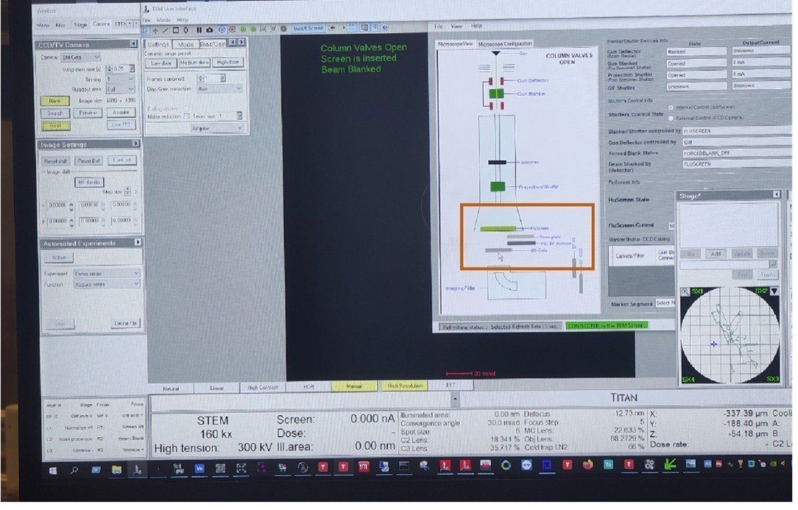

3. Visually verify the CETA camera position is retracted from the diagram.
4. In `TEMUI`, locate the `STEM Detector (User)` panel and verify all detectors are retracted:
   - HAADF: Retracted
   - BF-S (Bright Field): Retracted
   - DF-S (Dark Field): Retracted

### 1.2 Initialize the Arina detector

1. Open the instrument enclosure on the Spectra 300.

   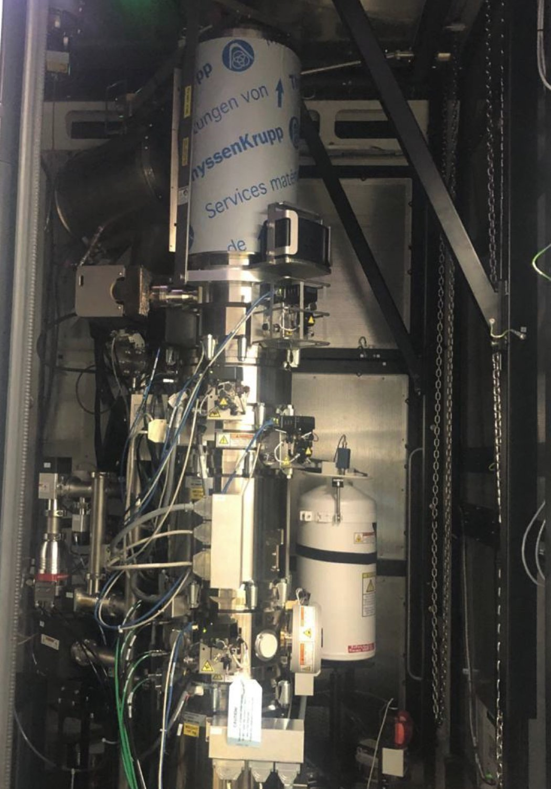

2. Locate the Dectris Arina detector unit inside the enclosure.

   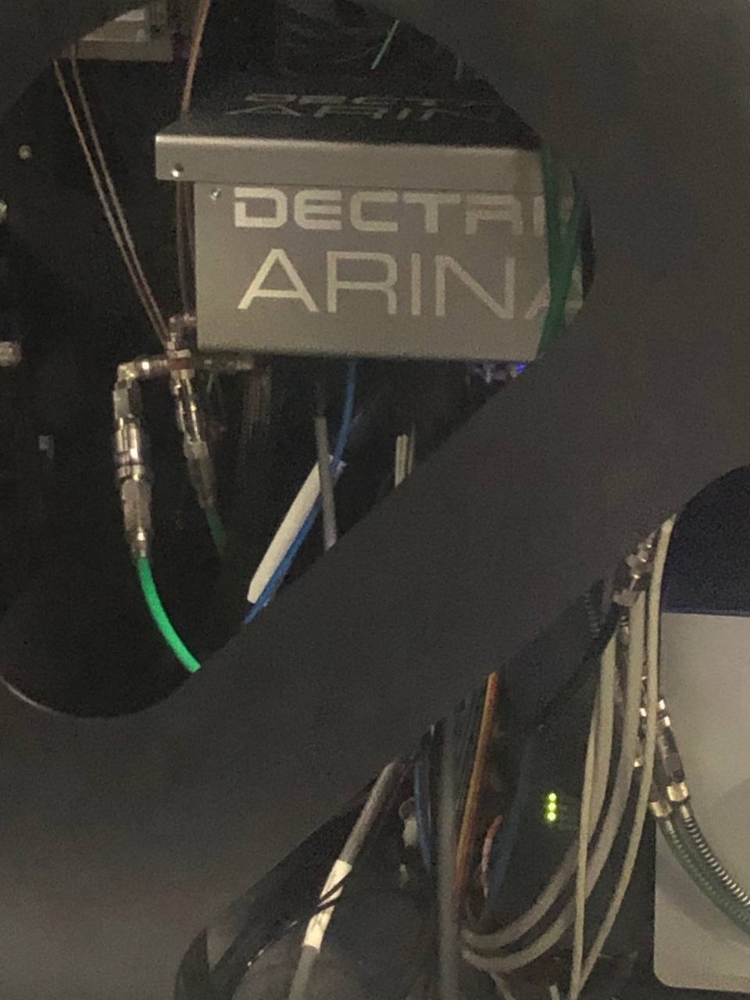

3. Press and hold the button below the Arina detector (blue indicator light) for 10 seconds. When powered on, the button stays pressed in and the blue light is illuminated.

### 1.3 Connect remote software

1. On the control workstation, open Firefox and click the remote connection bookmark.

   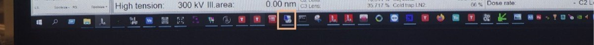

2. Enter the detector IP address: `192.168.12.73`.
3. Click `Initialize detector`. Wait for initialization to complete before proceeding. The interface shows a progress bar while the detector initializes.

   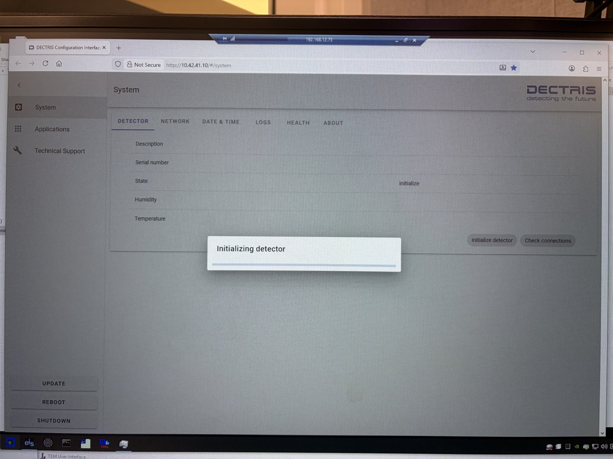

### 1.4 Configure file saving

1. Open the NOVENA detector software.
2. Click `Save Images` and select the destination folder.

   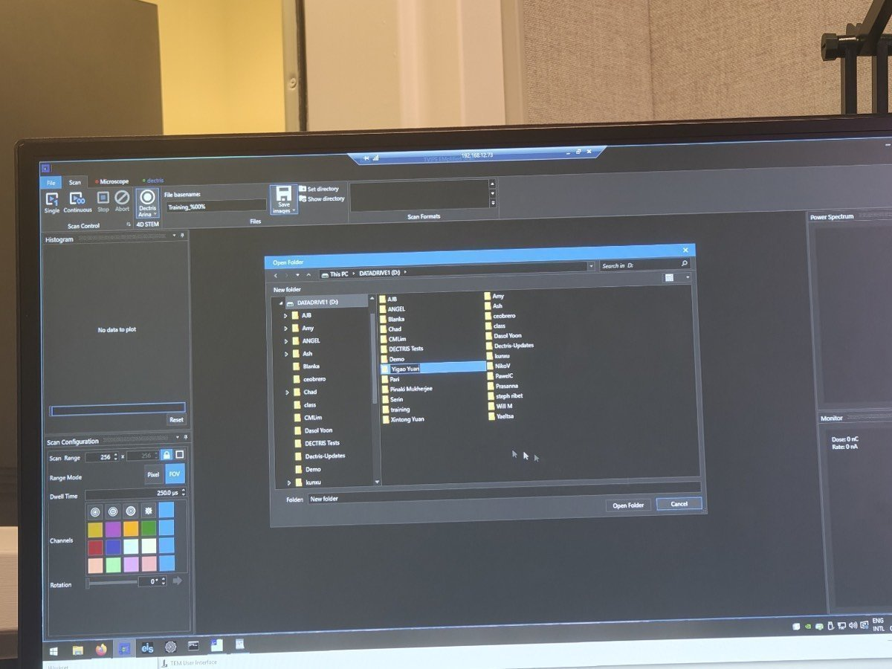

3. Set the filename format to `(name)_%00%`. The `%00%` placeholder auto-increments the frame number.
4. Use `Continuous` for live streaming (preview) and `Single` to record and save a dataset.

## Part 2: Beam configuration (optional)

The [STEM (Spectra)](../spectra_STEM/index.md) guide sets 30 mrad convergence angle by default. If that is suitable for your experiment (e.g., ptychography), skip this section and go directly to [Part 3: Acquisition](#part-3-acquisition). If you need a different convergence angle (e.g., nanobeam diffraction), follow the steps below.

<strong>Why change the convergence angle for 4DSTEM?</strong>

The convergence angle depends on the type of 4DSTEM experiment. For ptychography, 30 mrad (the same as standard STEM) works well because overlapping disks are part of the reconstruction. For nanobeam diffraction, where separated Bragg disks are needed to index reflections, a much smaller angle is used, typically 1 to 10 mrad depending on the material and the required disk separation.

**Interactive demo:** Explore how convergence angle affects the CBED pattern at [bobleesj.github.io/electron-microscopy-website/cbed](https://bobleesj.github.io/electron-microscopy-website/cbed)

### 2.1 Enable descan

1. In `TEMUI`, locate the `STEM Imaging (Expert)` panel and enable `Descan`.

### 2.2 Configure beam for nanobeam diffraction

The default STEM setup uses C2 = 70 and 30 mrad convergence angle. For nanobeam diffraction, reduce both to get separated Bragg disks. The table below shows typical values:

| Parameter | STEM default | Nanobeam diffraction |
|-----------|-------------|---------------------|
| C2 aperture | 70 | 50 |
| C3 aperture | 1000 | 30 |
| Convergence angle | 30 mrad | ~10 mrad |
| Beam current | ~0.150 nA | ~0.032 nA |
| Camera length | 91 mm | 230 mm |

<strong>Why change the C2 aperture?</strong>

The C2 aperture limits the angular range of electrons entering the probe-forming optics. A smaller aperture (50 vs 70) blocks more off-axis electrons, producing a more coherent beam with cleaner diffraction patterns at each probe position. The C2 aperture size and convergence angle are proportional (approximately 7:1 ratio, e.g. C2 = 70 gives ~10 mrad).

> TODO: Confirm the C2 aperture to convergence angle ratio with staff

1. In `TEMUI`, go to `Tune` tab, then `Apertures`. Change C2 from 70 to 50, and C3 from 1000 to 30.

   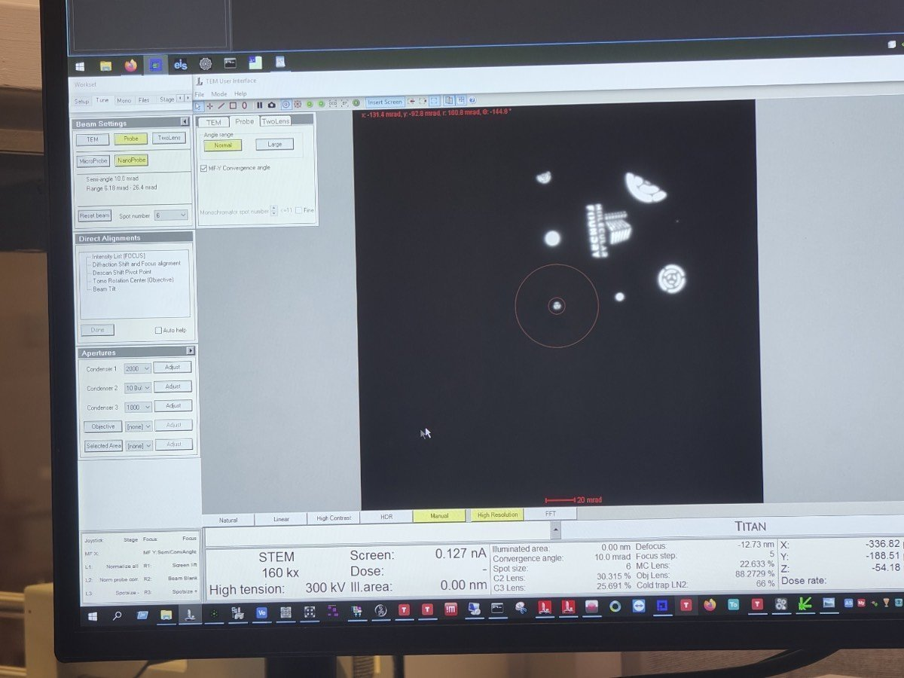

2. In `Beam Setting`, click `MF-Y Convergence Angle`. Use the `mulY` knob to adjust the convergence angle to 10 mrad, then click `MF-Y Convergence Angle` again to deselect.

   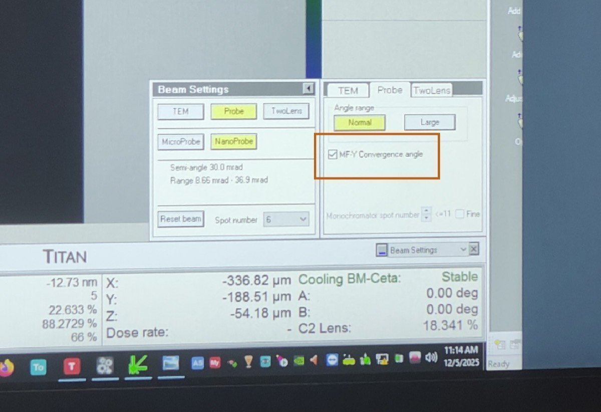

3. Adjust beam current: in `TEMUI`, go to `Mono`, click `Focus`, and use the intensity knob to set the current to ~0.032 nA.

4. Set the camera length to 230 mm (or 285 mm depending on the required angular range for your material).

### 2.5 Retract HAADF

1. In `TEMUI`, retract the HAADF detector. The HAADF ring would block electrons from reaching the Arina detector below.

## Part 3: Acquisition

### 3.1 Insert detector and configure scan

1. On the Arina hand panel, press `Insert` to move the detector into position. The green "Inserted" light confirms the detector is in place.

2. On the scan control box, press `EDS Scan`.

   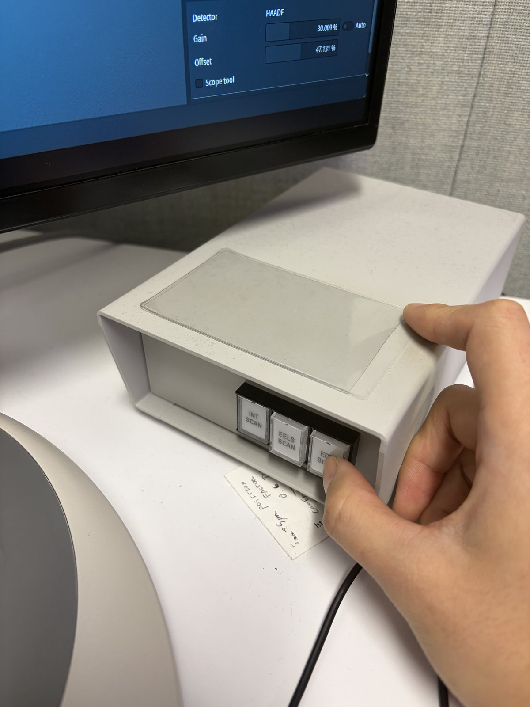

3. Press `R1` on the hand panel to lift the fluorescent screen. The Arina detector sits below the screen.

### 3.2 Acquire data

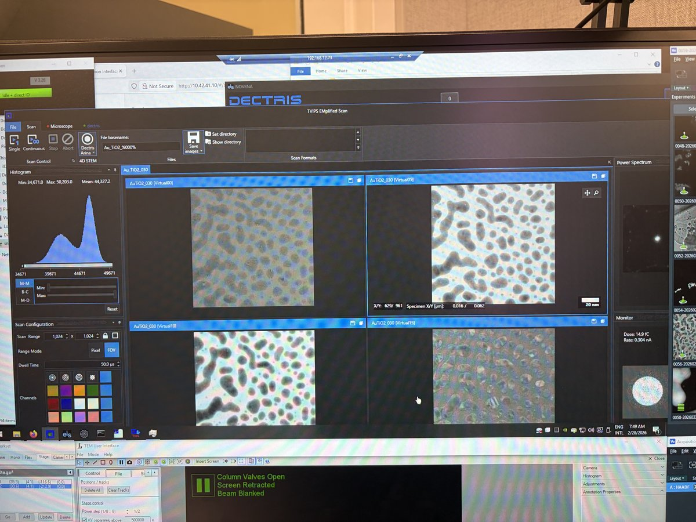

1. In the NOVENA software, click `Scan`, then `Continuous` to start a live preview. Verify the central beam is centered on the detector.
2. If the beam is off-center, use the `mulXY` knobs with diffraction shift to center it.
3. Once centered, click `Stop`, then click `Single Scan` to acquire and save the dataset.

   > **NOTE:** Each scan produces a 4D dataset: a CBED pattern at every pixel in the scan area. File sizes can be large depending on scan resolution and detector binning.

### 3.3 Quick analysis

1. In the NOVENA software, use `Rebin` and `Reprocess` for a quick check of the acquired data. For detailed analysis, export the data for processing with external software (py4DSTEM, etc.).

## Part 4: End session

### 4.1 Retract the Arina detector

1. On the Arina hand panel, press `Retract` to move the detector out of the beam path. The green "Retracted" light confirms the detector is clear.

   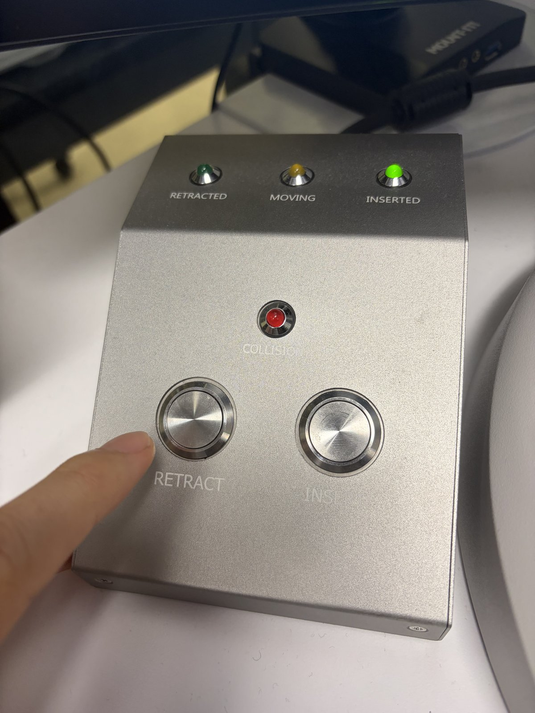

### 4.2 Power off the detector

1. Open the Spectra 300 instrument enclosure.
2. Press and hold the button below the Arina detector for 10 seconds. The button releases and the blue indicator light turns off.

### 4.3 Close session

Follow the steps in [End session](../sample-loading/index.md#end-session).

## Changelog

- Feb 28, 2026 - Rewrite SOP by Sangjoon Bob Lee with full procedural instructions, inline FAQ dropdowns, and new images
- Dec 10, 2025 - First draft and images shared by Guoliang Hu
