# Titan Spectra 300 STEM Alignment Guide

This guide covers STEM alignment on the Spectra 300 at Stanford SNSF (Stanford Nano Shared Facilities). Based on Andrew Barnum's hands-on training with step-by-step screenshots.

**Prerequisite:** A standard training sample (gold on carbon) is already loaded and the holder is inserted into the Spectra 300. For sample loading procedures, see [Start session](../sample-loading/index.md#start-session).

**Acronyms:**

- `mulXY` - Multifunction X/Y knobs on hand panel
- `TEMUI` - TEM User Interface (software)

**Workstation layout:**

| Monitor | Software | Purpose |
|---------|----------|---------|
| Bottom left | `TEMUI` | Microscope control, vacuum, alignments |
| Bottom right | `Velox` | Live imaging, acquisition |
| Top left | `Probe Corrector S-CORR` | Aberration measurement & correction |
| Top right | Velox image gallery | Captured images from Velox |

## Overview

This guide covers three main phases:

| Phase | Procedures | Time |
| ----- | ---------- | ---- |
| [Part 1: Setup & Alignment](#part-1-setup--alignment) | Vacuum check, eucentric height, STEM mode configuration, direct alignments, monochromator tune, HAADF setup | 5-10 min |
| [Part 2: Probe Correction](#part-2-probe-correction) | Correct aberrations (C1A1, Tableau) to achieve sub-angstrom probe | 10-15 min |
| [Part 3: Imaging](#part-3-imaging) | Image acquisition, Sherpa fine-tuning (optional) | varies |

 
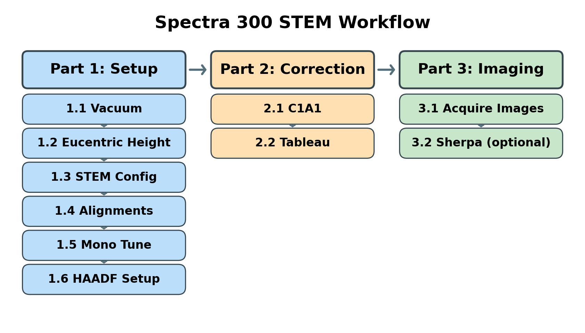

## Part 1: Setup & Alignment

### 1.1 Vacuum check

Before imaging, verify that the vacuum system is ready and the column valves can be safely opened. Poor vacuum conditions can damage the electron source and contaminate the sample.

- [ ] **Check vacuum status**

  1. In `TEMUI`, open `Setup` tab.
  2. Locate vacuum status panel. Status shows "All Vacuum (Closed)" and `Col. Valves Closed` button is yellow.

     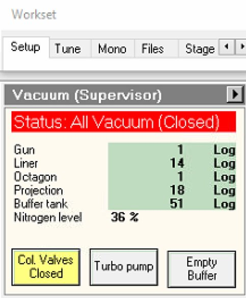

- [ ] **Verify vacuum pressure**

  1. Check vacuum pressure values on the log scale (lower = better):

     | Gauge | Typical Log Value | Notes |
     |-------|-------------------|-------|
     | Gun | 1 | Critical for source lifetime |
     | Liner | 14 | Column vacuum |
     | Octagon | 1 | Sample area |
     | Projection | 19-21 | Below sample |
     | Buffer tank | 41-51 | Empty if above 51 |

  2. If buffer tank pressure is above 51, click `Empty Buffer`.
     - Pumps cycle audibly.

     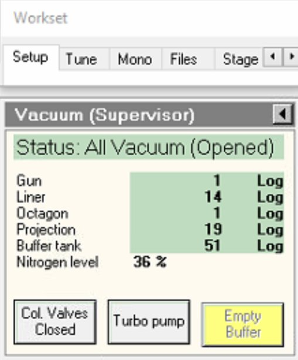

  3. Wait for value to decrease before proceeding.

     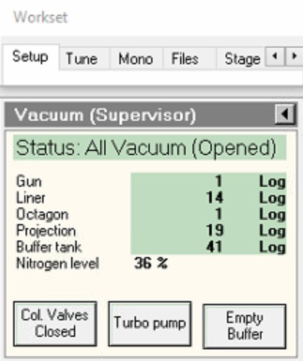

- [ ] **Open column valves**

  1. Click `Col Valves Closed` button.
     - Status changes to "All Vacuum (Opened)".

     > **NOTE:** The system only allows opening if vacuum levels are acceptable. Once opened, the electron beam path is clear from gun to sample.

     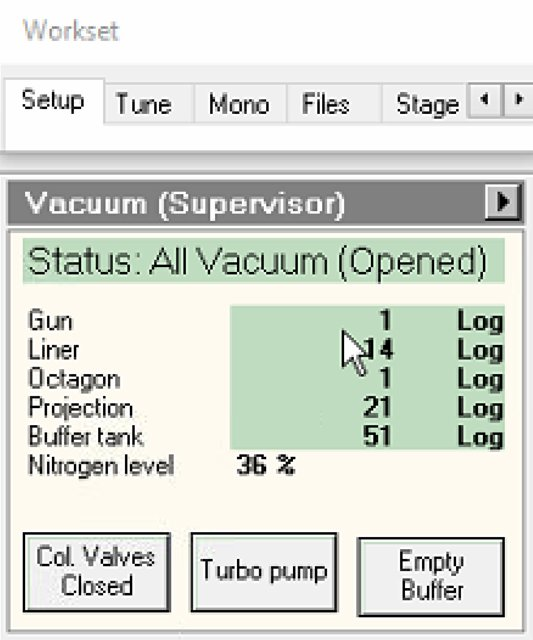

### 1.2 Find eucentric height

Complete eucentric height alignment after loading each sample and before imaging. Do **not** skip this step. At eucentric height, the sample remains stationary when tilted. This is essential for accurate imaging and tomography. The ronchigram "blow-up" method provides a quick way to find this position.

- [ ] **View ronchigram**

  1. In `TEMUI`, view the ronchigram in the main display.
  2. Position probe on a sample region that scatters electrons (not over a hole or vacuum).

     > **NOTE:** The ronchigram is the diffraction pattern formed when the convergent probe is stationary. When defocused, it contains shadow images of sample features, making structure visible during z-height adjustment.

     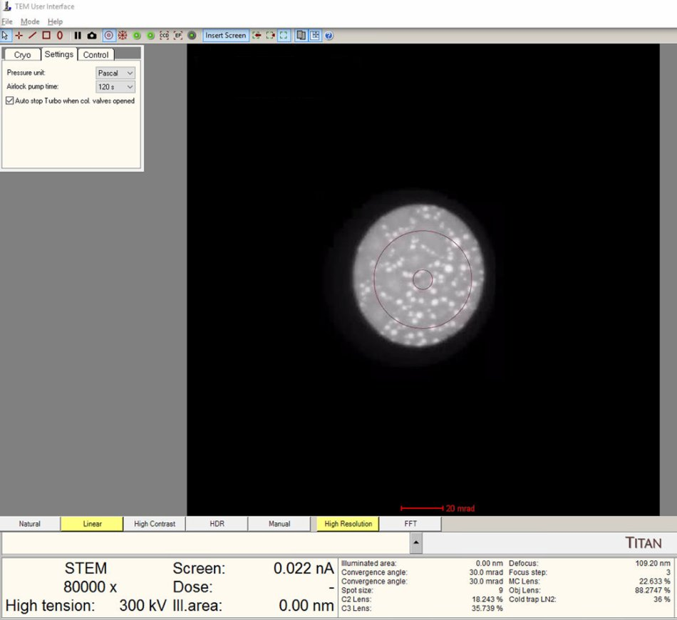

- [ ] **Adjust z-axis to find blow-up point**

  1. Lower magnification to 5,000x.

     > **NOTE:** A wider field of view makes ronchigram changes easier to observe.

  2. Use z-axis buttons on hand panel to move stage up or down.
     - Buttons are pressure sensitive: press harder for faster movement.
     - Start with gentle presses for fine control.

  3. Watch the ronchigram while adjusting z-height. The pattern "zooms" in or out as the sample moves through focus.

     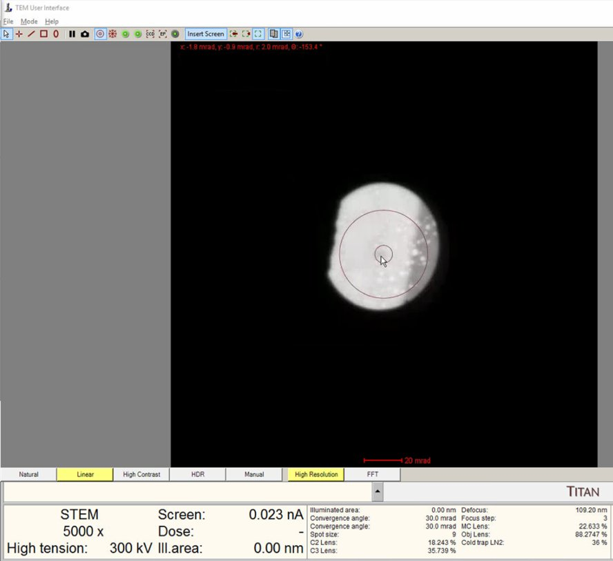

  4. Continue adjusting. The ronchigram expands when approaching eucentric height.

     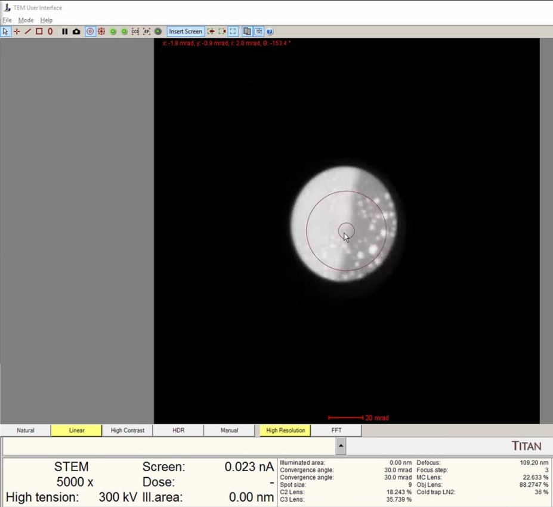

  5. Find the "blow-up" point where the ronchigram is largest.
     - Flat central region of ronchigram is maximized.
     - If ronchigram shrinks, reverse direction to find maximum expansion.

     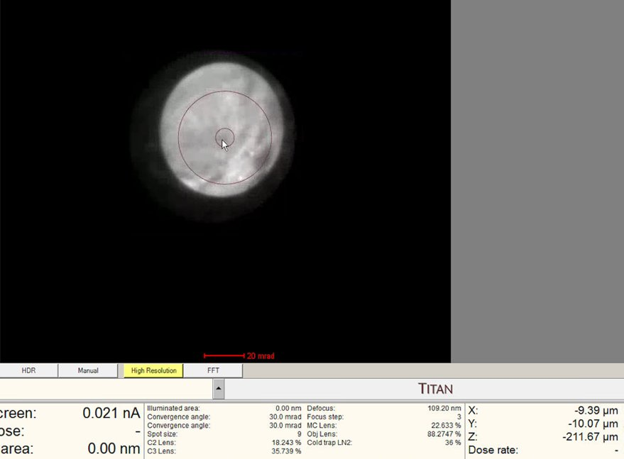

### 1.3 STEM mode configuration

Before performing alignments, configure the STEM imaging parameters and verify detector settings.

- [ ] **Enable descan**

  1. In `TEMUI`, locate the `STEM Imaging (Expert)` panel.
  2. Enable `Descan` checkbox.

     > **NOTE:** Descan compensates for beam movement during scanning, keeping the diffraction pattern stationary on the detector.

     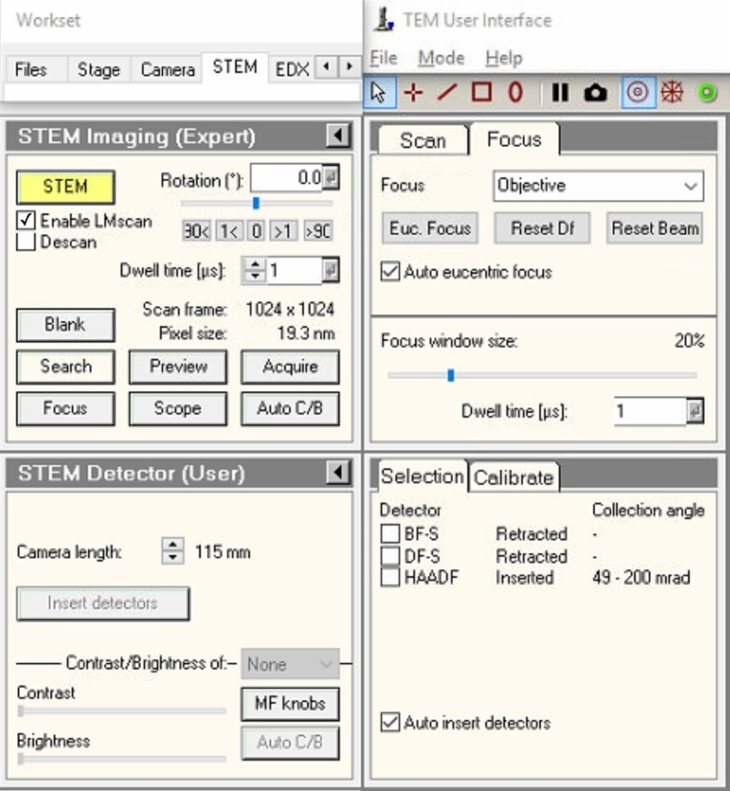

- [ ] **Verify HAADF is retracted**

  1. Locate the `Selection` panel.
  2. Verify detector states:
     - BF-S (Bright Field): Retracted
     - DF-S (Dark Field): Retracted
     - HAADF: Retracted
  3. Toggle `HAADF` checkbox on then off to confirm retracted state.

     > **NOTE:** HAADF must be retracted during ronchigram alignment. The HAADF is a ring-shaped detector with a central hole. If inserted, high-angle electrons hit the ring instead of the camera below, blocking part of the ronchigram.

     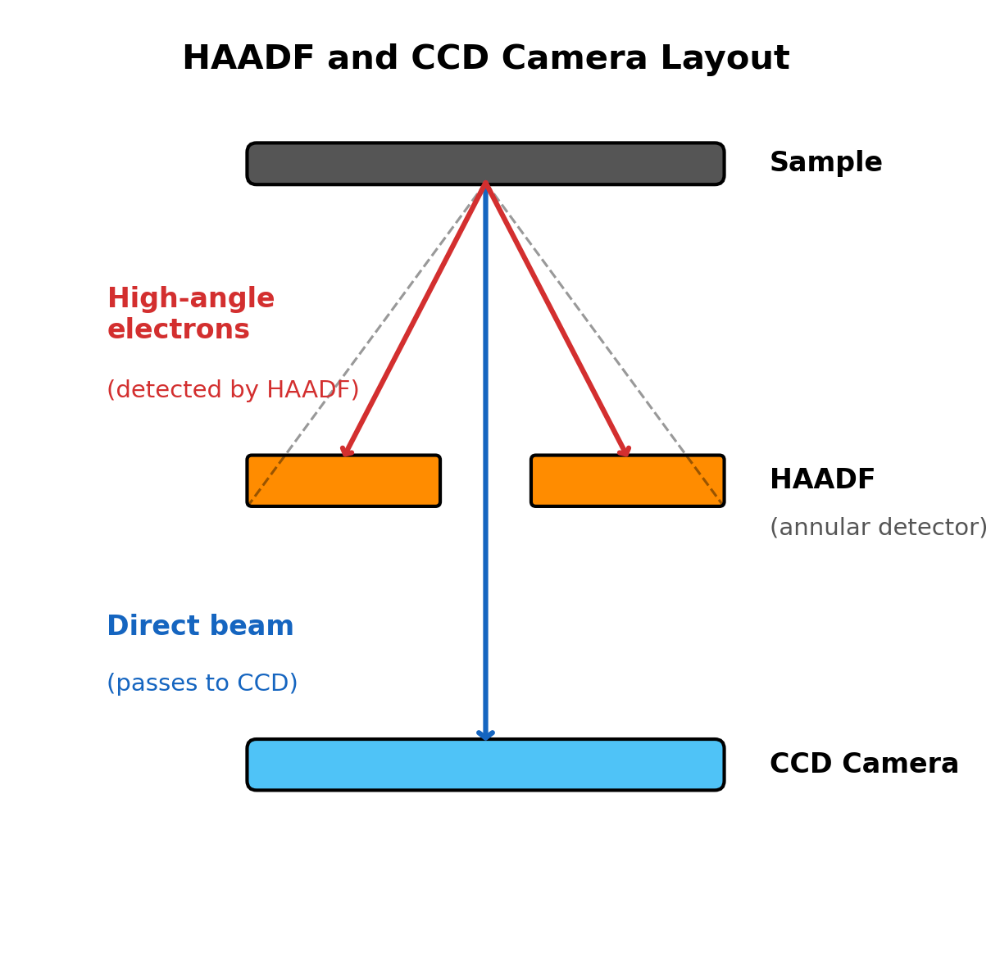

- [ ] **Set detector layout in Velox**

  1. Open `Velox` acquisition software.
  2. Open detector layout display.
  3. Set camera length to 91 mm.

     > **NOTE:** Camera length determines detector collection angles. The layout display shows the angular ranges for each detector.

     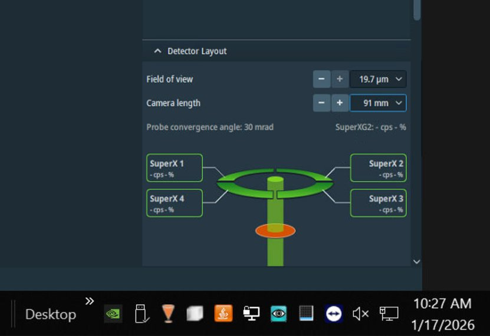

- [ ] **Configure beam settings**

  1. In `TEMUI`, go to the `Tune` tab and locate the `Beam Settings` panel.
  2. Select `Probe` mode.
     - Button is highlighted yellow when active.
  3. Select `NanoProbe` mode.
  4. Set spot number to 6.

     > **NOTE:** NanoProbe provides a smaller, more coherent probe than MicroProbe. Lower spot numbers produce smaller probes with lower current; higher numbers produce larger probes with more current.

     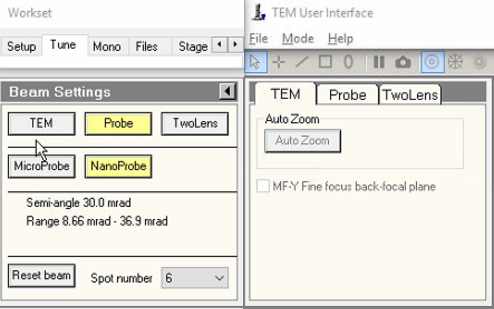

### 1.4 Direct alignments

The basic alignments center the electron beam and align it through the optical column. Perform these alignments at a magnification between 200-300kX. Proper alignment is essential for optimal resolution and probe symmetry.

- [ ] **Open Direct Alignments**

  1. In `TEMUI`, navigate to `Tune` tab, then `Direct Alignments`. This panel provides access to all fundamental beam alignment procedures.
  2. Select `Diffraction Shift and Focus alignment` to begin.

     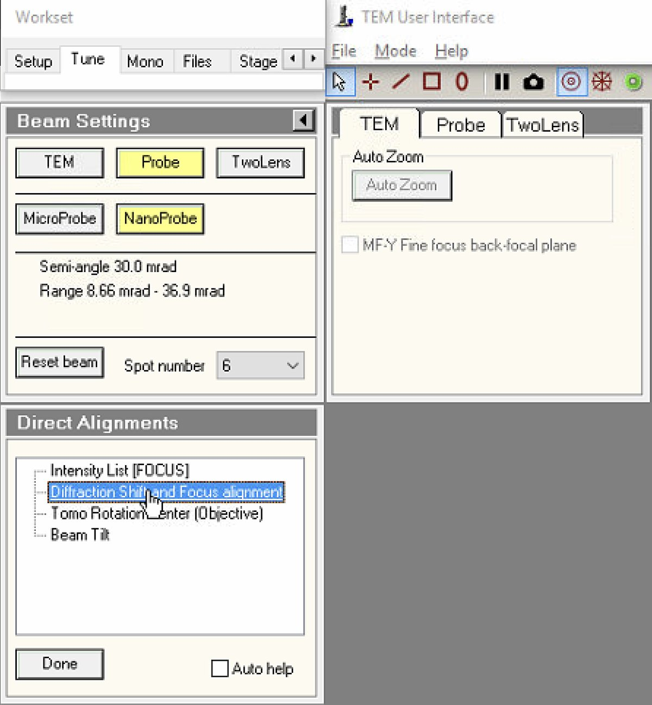

- [ ] **Center ronchigram**

  1. Observe the ronchigram position on the display. If the ronchigram is shifted from center, use the `mulXY` knobs to bring it back.

     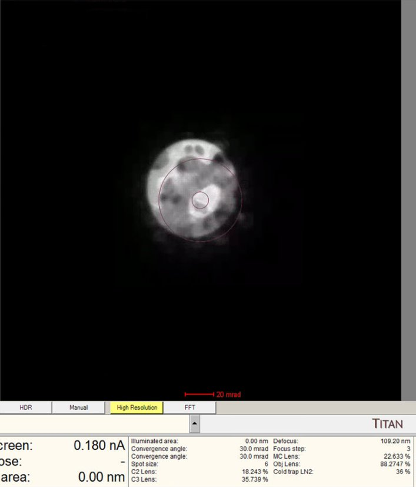

  2. The `mulXY` knobs now control diffraction shift. Adjust until the ronchigram is centered.

     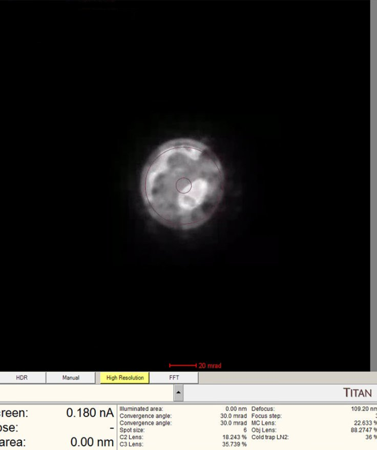

- [ ] **Reset STEM AutoTuning**

  1. In the quick dropdown menu, select `STEM AutoTuning`. This panel stores automatic alignment adjustments from previous sessions.
  2. Click `Reset` under Settings to clear stored values. This establishes a known baseline. Previous user adjustments persist and interfere with fresh alignments if not reset.

     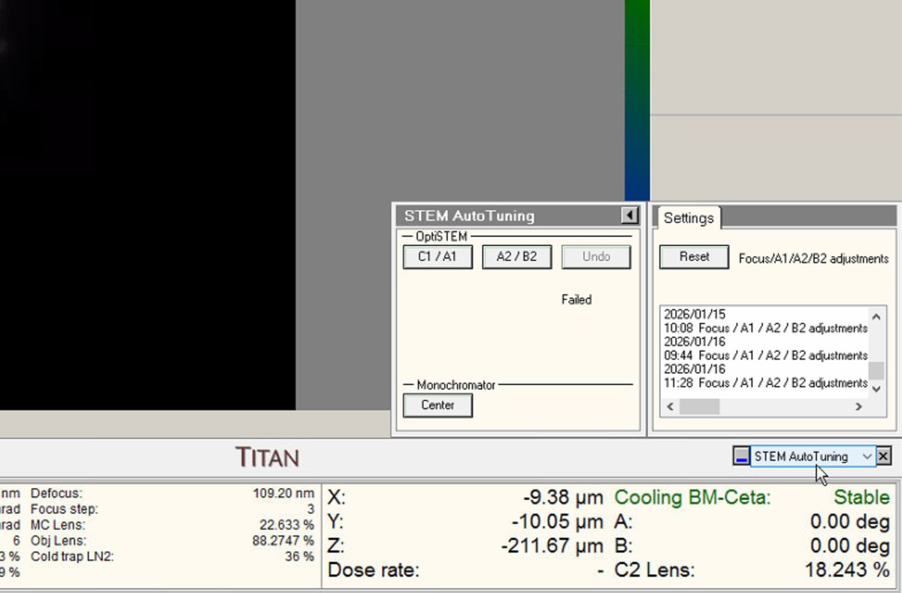

- [ ] **Switch to probe image mode**

  1. Press the `Diffraction` button on the hand panel to enter probe image mode (STEM scanning).

     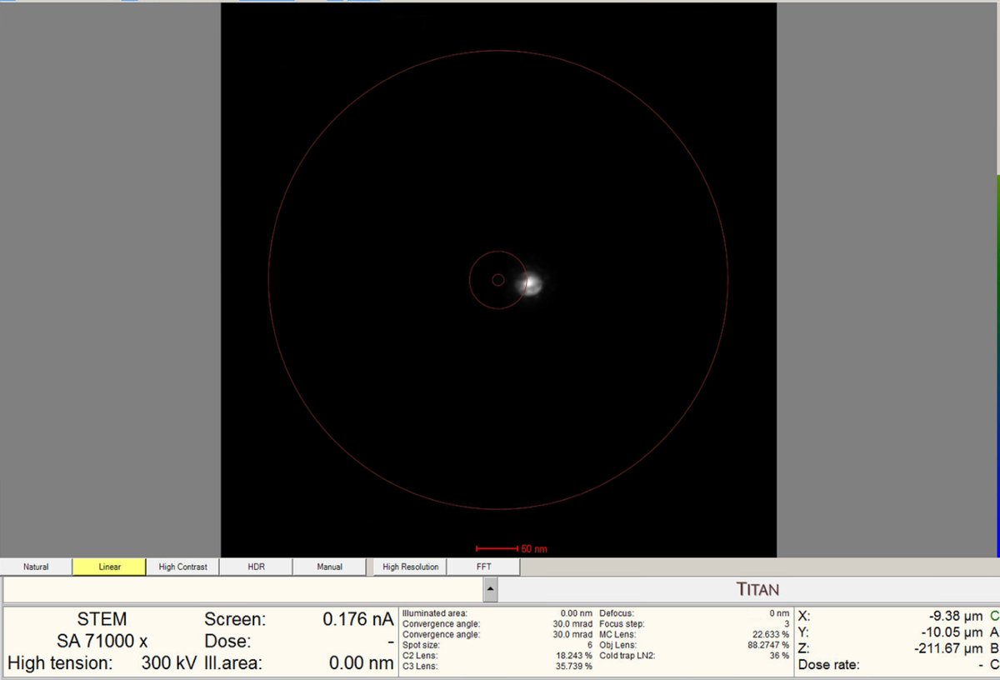

     > **Diffraction mode vs. Probe image mode**
    >
    > | Mode             | Probe      | Display                                                   |
    > |------------------|------------|-----------------------------------------------------------|
    > | Diffraction mode | Stationary | Ronchigram - diffraction pattern from convergent probe    |
    > | Probe image mode | Scanning   | STEM image - probe scans to build up image pixel by pixel |
    >
    > The `Diffraction` button on the hand panel toggles between these two modes.

- [ ] **Align beam shift**

  1. Click on `Beam shift` in the Direct Alignments panel. The `mulXY` knobs now control alignment beam shift.
  2. Use the `mulXY` knobs to center the beam on the screen. The beam responds smoothly to knob movements. If the beam moves too quickly, press `Fine` on the hand panel to reduce sensitivity.
  3. **Important:** If the beam is lost after clicking beam shift, reduce magnification until the beam is visible, center using the `mulXY` knobs, then increase magnification above 200kX and center again.
  4. Click `Done` once the beam is properly centered.

     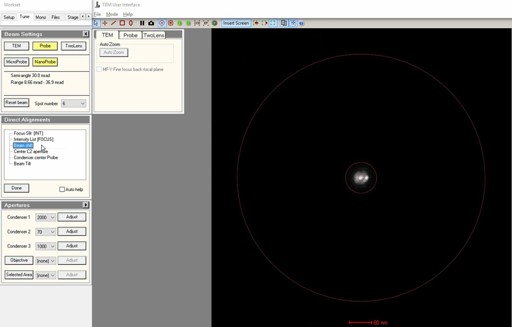

- [ ] **Center C2 aperture**

  1. Select `Center C2 aperture` from the alignment options. The system oscillates the C2 lens, causing the beam to expand and contract rhythmically.
  2. Watch the beam movement carefully. The beam pulses in and out. The goal is to make this expansion/contraction perfectly concentric (no lateral movement).
  3. Use the `mulXY` knobs to adjust the aperture position.
  4. Click `Done` when the movement is concentric.

     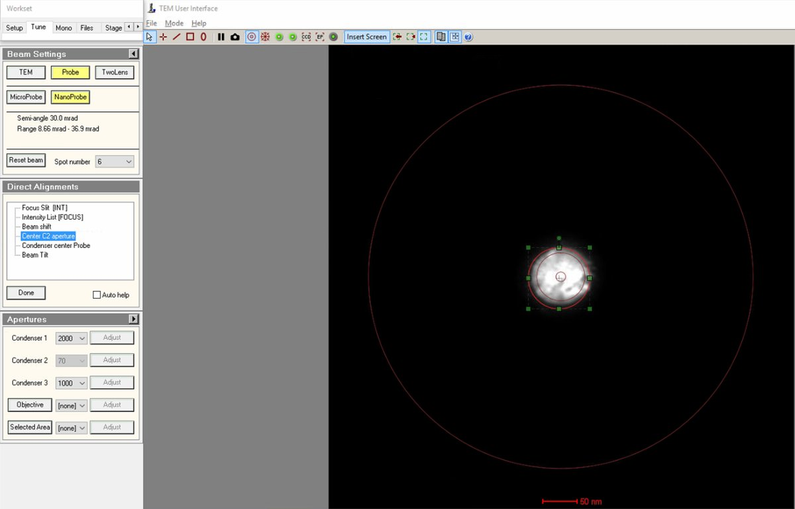

- [ ] **Align beam tilt**

  1. Select `Beam Tilt` from the alignment options. This alignment minimizes the lateral shift of the beam when tilting.
  2. Use the `mulXY` knobs to minimize lateral movement of the beam. When properly aligned, the beam changes angle without shifting position.
  3. Reduce the lateral x and y movements as much as possible using the `mulXY` knobs.
  4. Click `Done` once the lateral movement is minimized.

     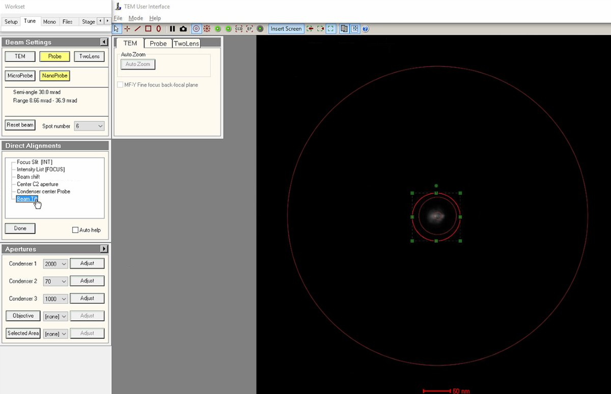

- [ ] **Verify final diffraction shift**

  1. Press the `Diffraction` button on the hand panel to switch back to diffraction mode (view the ronchigram).
  2. Return to `Diffraction Shift and Focus alignment` for a final centering check.
  3. Use `mulXY` to center the ronchigram precisely on the display. Centering confirms the beam is on the optical axis.
  4. Click `Done` to complete the direct alignments.

     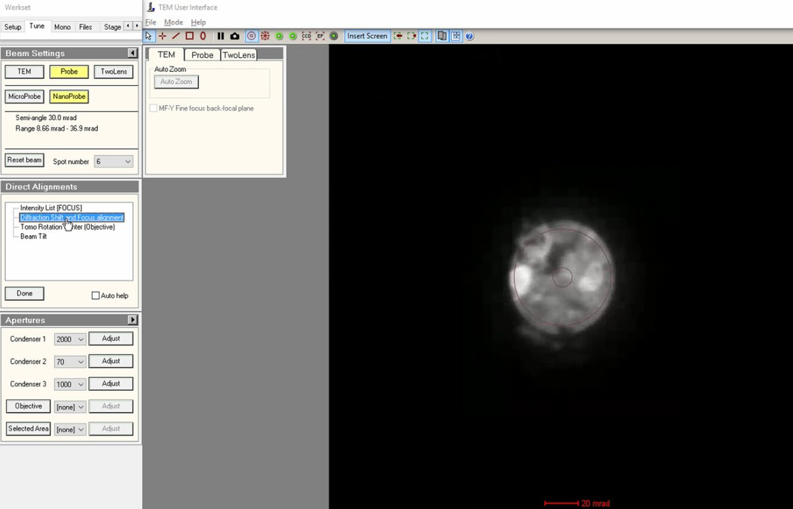

> **Note:** Mode changes (diffraction ↔ probe image, TEM ↔ STEM) disable descan. Re-enable descan after each mode switch. If the image looks distorted, verify `Descan` is enabled in `STEM Imaging (Expert)`.

### 1.5 Monochromator tune

Before proceeding to probe correction, check that the monochromator is properly aligned and not partially blocking the beam. The monochromator selects a narrow energy spread from the electron source, improving resolution but reducing beam current.

- [ ] **Open Monochromator Tune**

  1. In `TEMUI`, go to the `Mono` tab and locate the `Monochromator Tune (Expert)` panel. This panel provides controls for adjusting the monochromator position and focus.
  2. Click on both `Shift` and `Focus` buttons to enable adjustment mode. At this point, the **intensity knob** controls **monochromator focus** and the `mulXY` knobs control **monochromator shift**.

     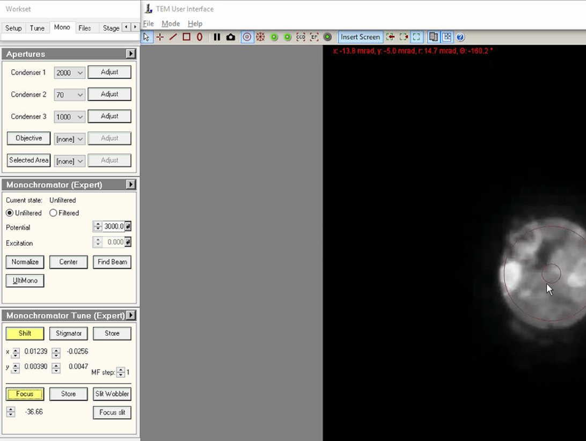

- [ ] **Adjust focus**

  1. Adjust the intensity knob to bring the Focus value close to 0. As the monofocus approaches zero, the screen current increases because more electrons pass through the monochromator slit.
  2. **Troubleshooting:** If no beam is shown, click `Linear` in the detector settings to switch from log to linear display mode.
  3. Watch the current readout while adjusting.

     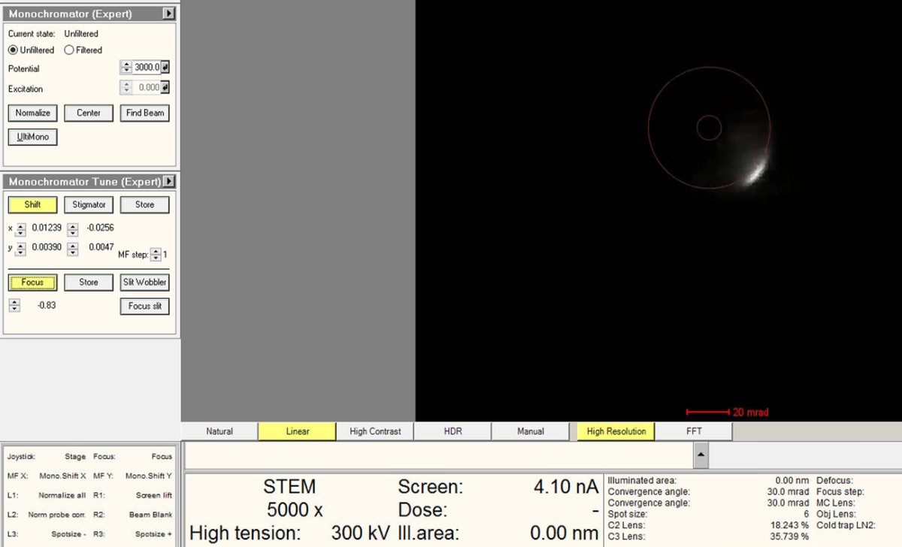

- [ ] **Center and adjust current**

  1. Adjust the `mulXY` knobs to center the beam through the monochromator. A jagged edge on the beam indicates the monochromator is clipping the beam.

     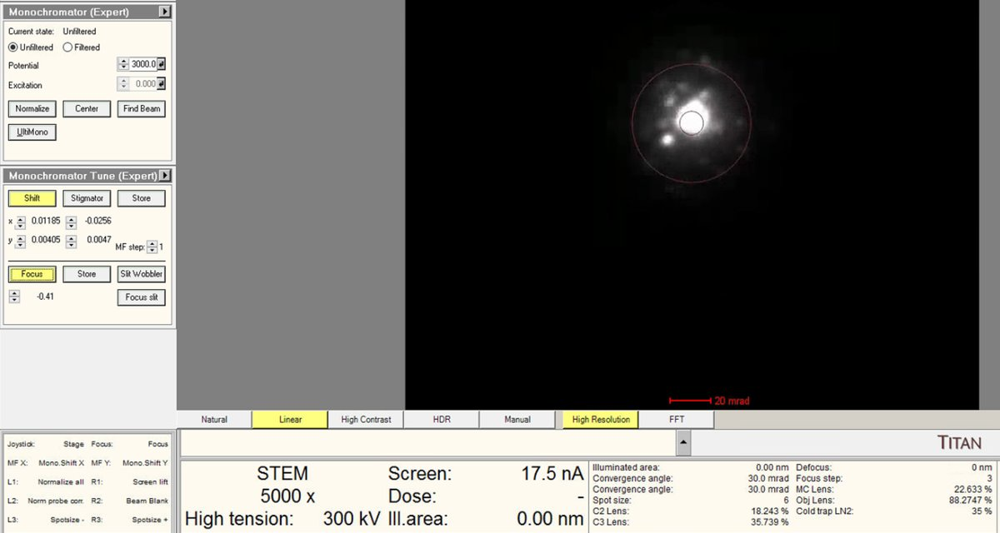

  2. Use the intensity knob to achieve the target beam current (~0.150 nA for high-resolution STEM).

     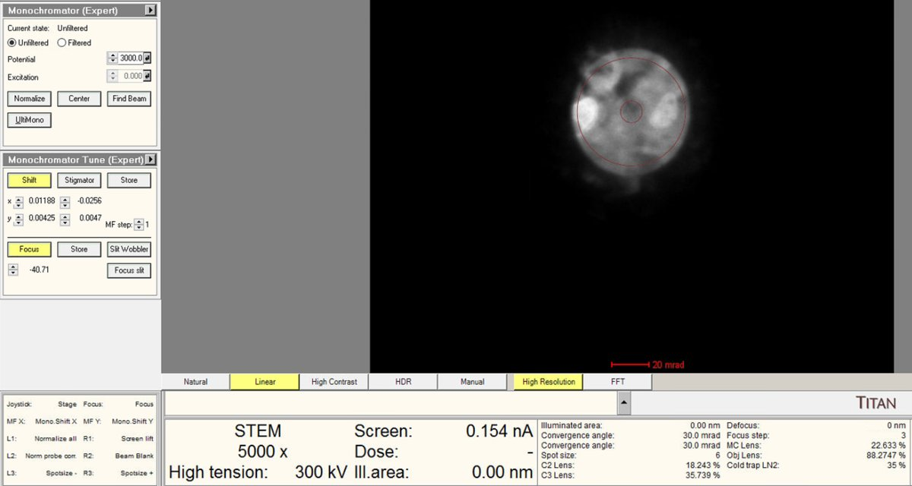

- [ ] **Deselect Shift and Focus**

  1. Click `Shift` again to deselect both buttons (they toggle together).
  2. This returns the intensity knob and `mulXY` knobs to their normal functions. Verify the current readout shows the target value before proceeding.

- [ ] **Re-verify eucentric height**

  1. Use the z-axis controls to return to the "blow-up" point (eucentric height). Monochromator adjustments affect focus; re-verify eucentric height.

### 1.6 HAADF imaging setup

Before running aberration correction, set up HAADF (High-Angle Annular Dark Field) imaging to view the sample and find a suitable region. HAADF provides Z-contrast imaging where heavier atoms appear brighter.

- [ ] **Switch to HAADF**

  1. In the `Velox` acquisition software, click `STEM` to enter STEM mode, then click `HAADF`. This automatically inserts the HAADF detector.
  2. Verify in `TEMUI` that the HAADF detector shows "Inserted" status with the correct collection angle (63-200 mrad).

     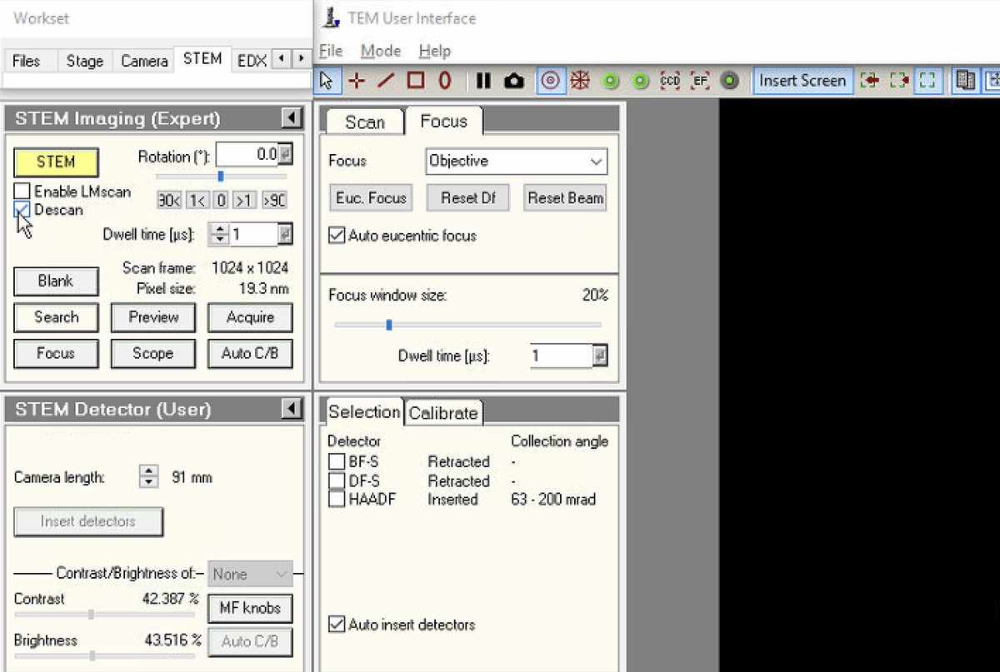

- [ ] **Verify Descan is enabled**

  1. In `TEMUI`, go to `STEM Imaging (Expert)` and verify `Descan` is enabled. Mode changes disable descan; re-enable after switching modes.

- [ ] **Start live scanning**

  1. Click the play button in `Velox` to start live scanning.
  2. The image is saturated (all white) initially. Detector signal adjustment follows in the next step.

     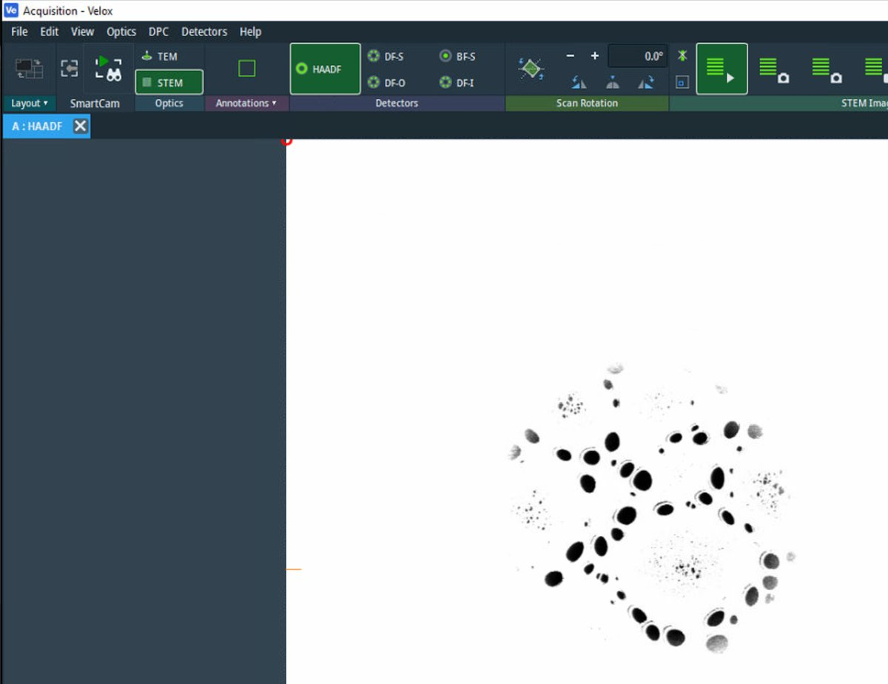

- [ ] **Adjust detector signal**

  1. The detector is saturated. In `Velox`, click `Scope tool` to enable signal adjustment.
  2. Adjust `Gain` and `Offset` so the signal does not go above the dotted red lines.

     > **Signal math:** Display = (Gain × Signal) + Offset
     >
     > - **Gain** (= Contrast): Multiplier that stretches the signal. 100% = no change, 200% = double the contrast
     > - **Offset** (= Bias/Brightness): Shifts the baseline as a percentage of the display range

     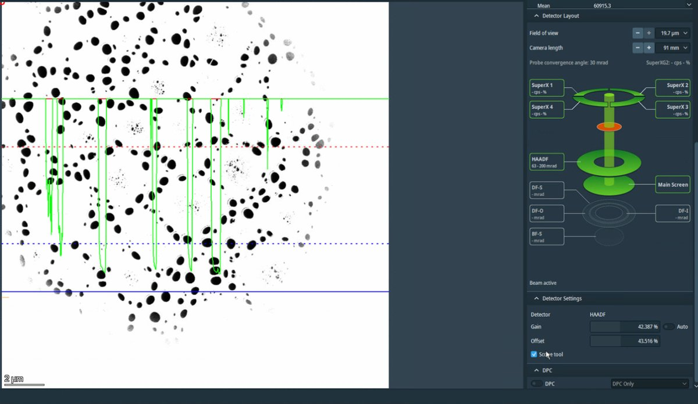

  3. If the signal is clipping at zero (bottom of display), increase `Offset` to shift the signal up.

     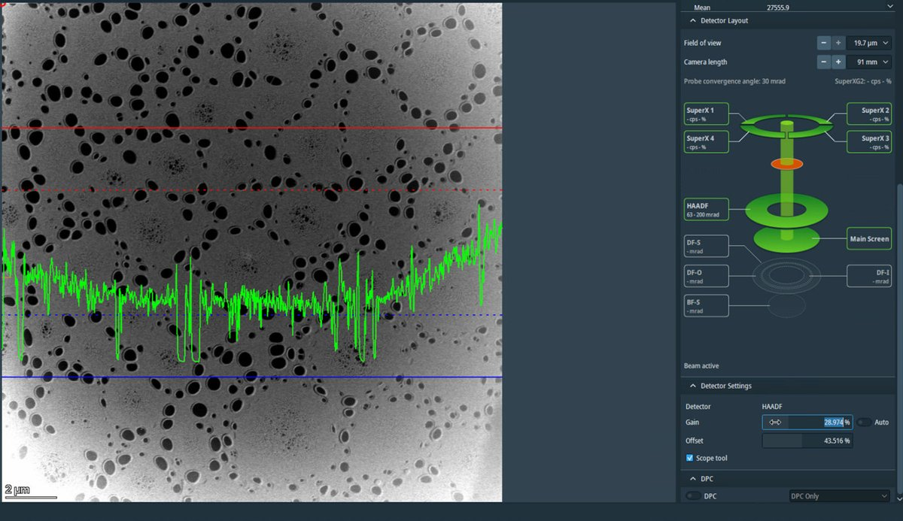

  4. Adjust the magnification to ~20,000x using the magnification knob. Once adjusted, uncheck `Scope tool` to turn it off.

     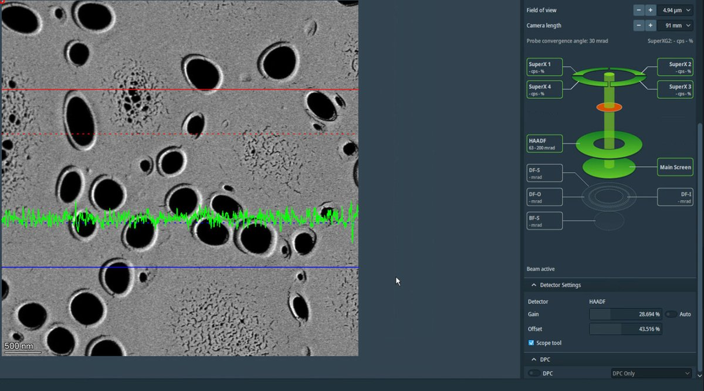

- [ ] **Find sample boundary**

  1. Reduce magnification to ~10,000x and navigate with the joystick to find a suitable region.
  2. Locate a boundary region with particles at the edge of a support film, with vacuum visible.
  3. This type of region provides excellent contrast for aberration correction.

     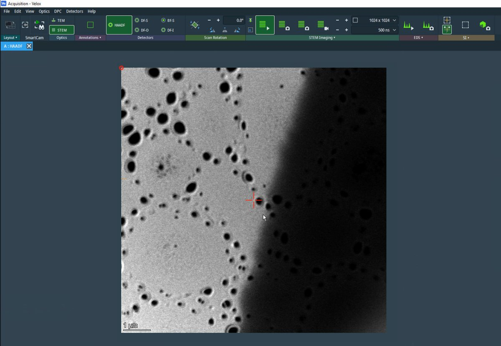

- [ ] **Adjust focus**

  1. Once a suitable boundary is found, increase magnification to ~160,000x. Alternate between magnification and z-axis adjustments until focus is sharp.

     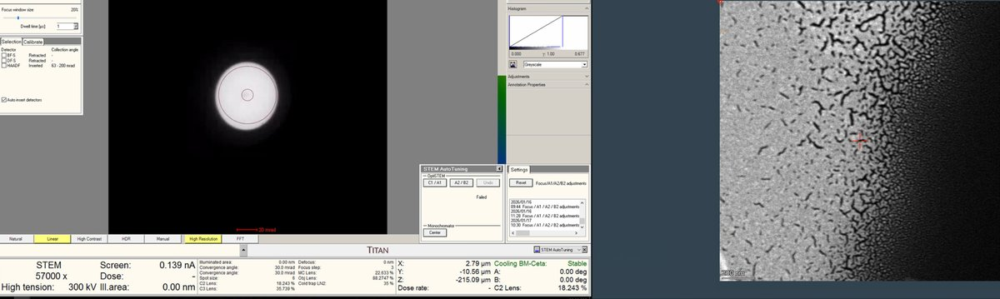

  2. Adjust the z-axis while watching the HAADF image. Features become sharper as focus is approached.

     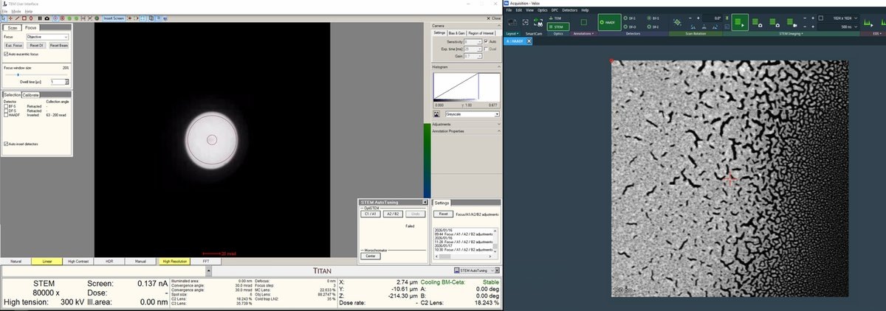

  3. Continue adjusting magnification and z-axis.

     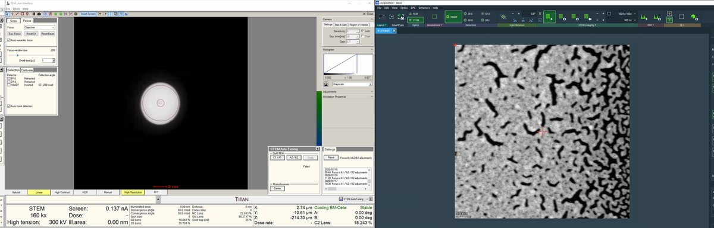

  4. Finalize the position with sharp features and distributed particle sizes.

     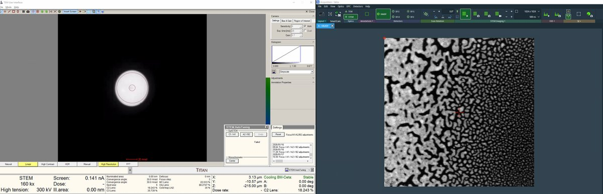

  > **Distributed particles are important for aberration measurement.** Aberrations vary with position relative to the optical axis (e.g., coma increases further from center). The correction algorithm requires ronchigram data from multiple positions to accurately fit the aberration coefficients.

## Part 2: Probe Correction

Aberrations distort the electron probe and degrade image resolution. The goal of probe correction is to achieve a flat, aberration-free ronchigram. The figure below shows how individual aberrations affect the ronchigram appearance:

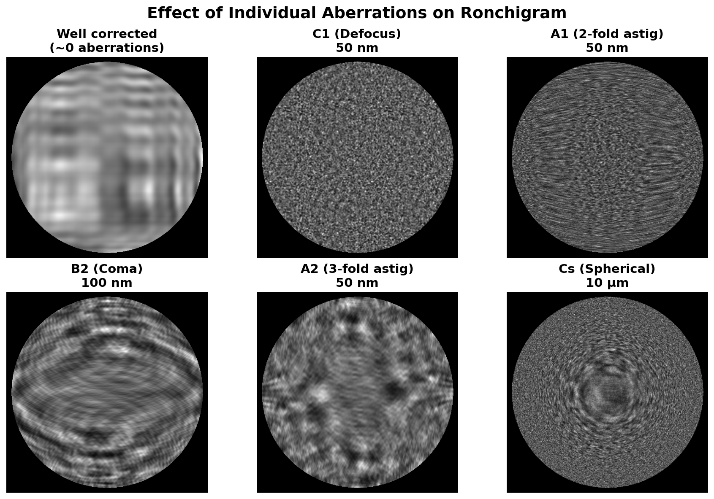

> **Interactive demo:** Explore how aberrations affect the ronchigram at [bobleesj.github.io/electron-microscopy-website/ronchigram](https://bobleesj.github.io/electron-microscopy-website/ronchigram)

Probe correction uses two tools in the `Probe Corrector S-CORR` software:

| Tool | What it corrects | How it works |
|------|------------------|--------------|
| **C1A1** | First-order: defocus (C1) and 2-fold astigmatism (A1) | Continuous ronchigram measurement; click buttons to apply |
| **Tableau** | Higher-order: A2, B2, C3, S3, A3 | Single measurement sequence with beam tilts; then apply |

**The correction workflow:**

The following workflow is covered in this section. Follow the steps below, then use this diagram as a quick reference:

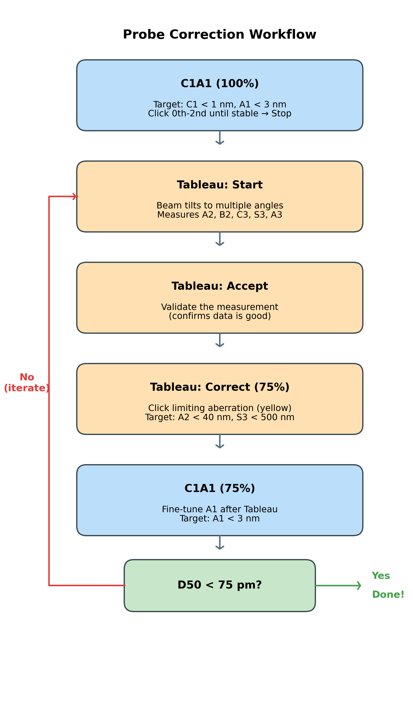

### 2.1 C1A1 correction

C1A1 corrects first-order aberrations: defocus (C1) and 2-fold astigmatism (A1). These are the dominant aberrations that must be corrected before higher-order Tableau measurement. The C1A1 procedure analyzes the ronchigram to measure and correct these aberrations iteratively.

- [ ] **Open Probe Corrector**

  1. On the top left monitor, open the `Probe Corrector S-CORR` software (main interface for aberration measurement and correction).
  2. Check the mode indicator in the top right. Verify it shows `STEM@300KV`:

     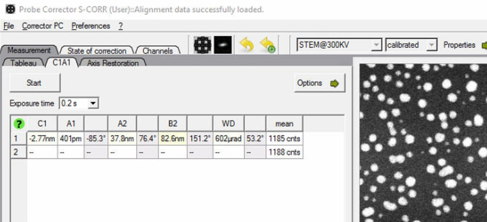

  3. If `MC_STEM@300KV` appears instead, the system is in monochromated STEM mode. Follow the steps below to reset to standard STEM mode. If `STEM@300KV` is displayed, skip ahead to "Configure C1A1 options."

     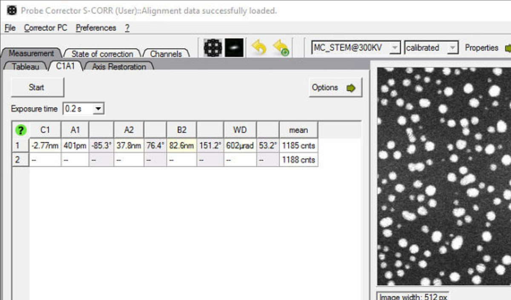

  4. To reset, in TEMUI go to `Mono`, then open `Monochromator (Expert)` and click `Filter`:

     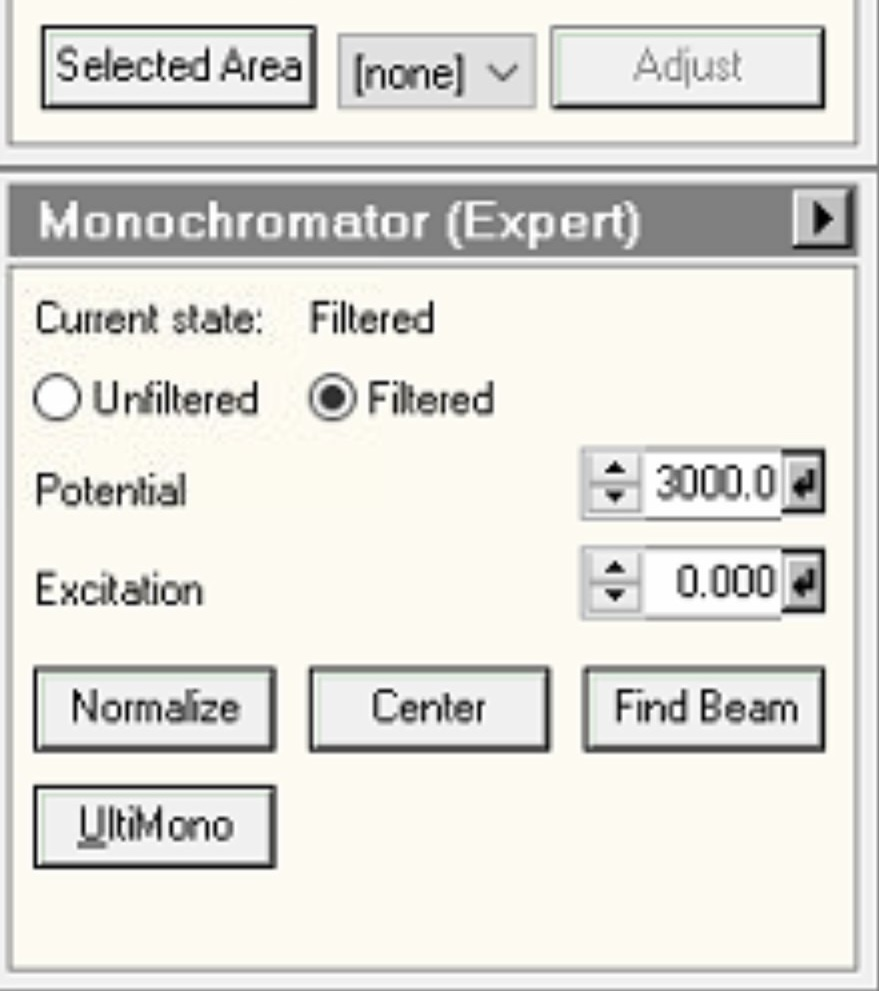

  5. Then click `Unfilter` to reset to standard STEM mode:

     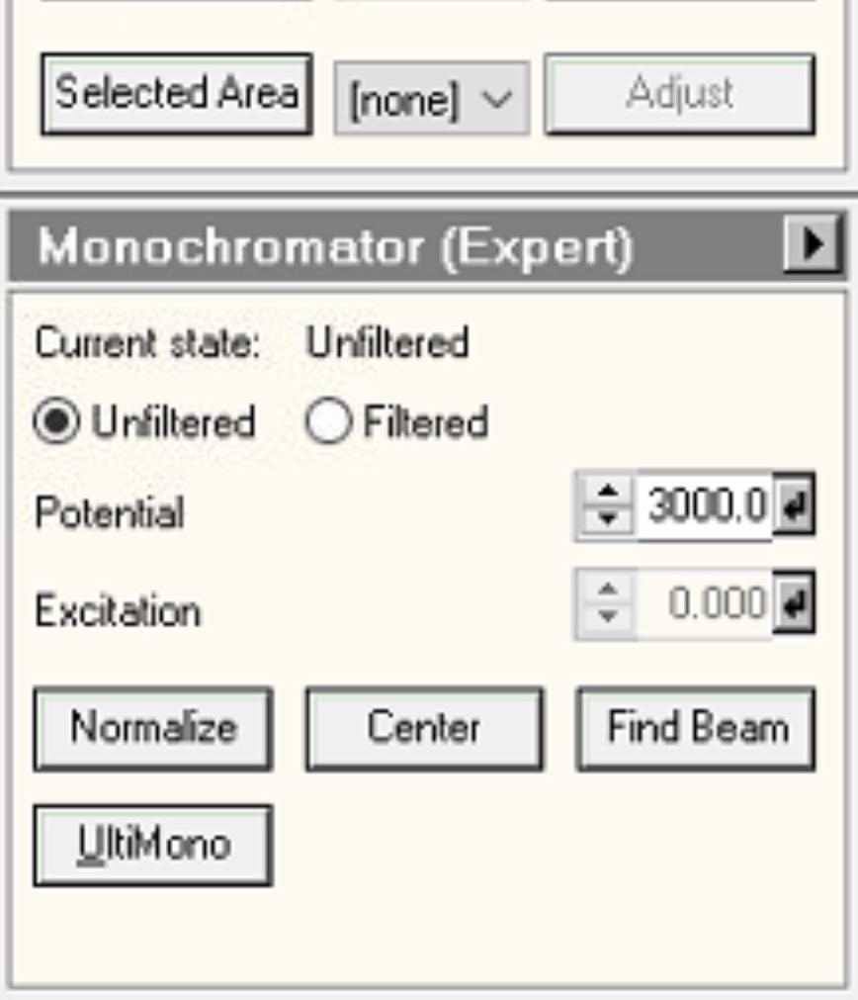

- [ ] **Configure C1A1 options**

  1. In the Probe Corrector software, click `Options` to expand the configuration panel:

     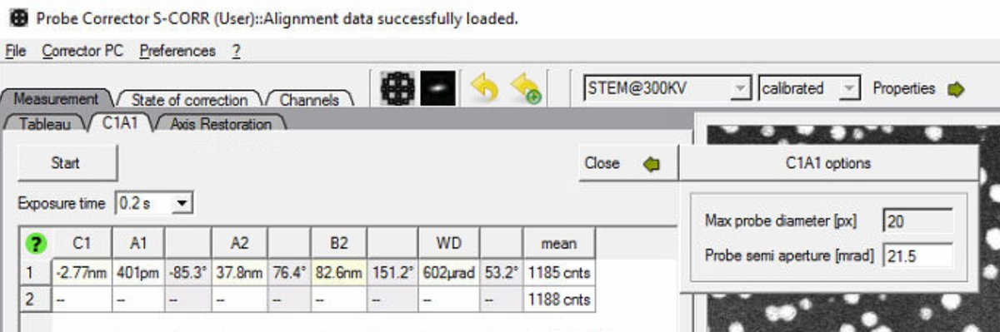

  2. Set `Probe semi aperture` to 30 mrad:

     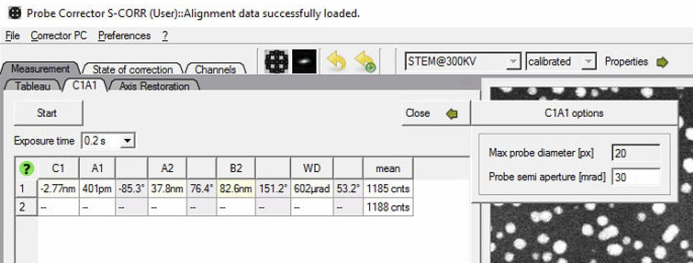

- [ ] **Switch to diffraction mode**

  1. Stop live scanning in `Velox` by clicking the play button, then press the `Diffraction` button on the hand panel. C1A1 analyzes the ronchigram, so diffraction mode (stationary probe) is required, not probe image mode (scanning):

     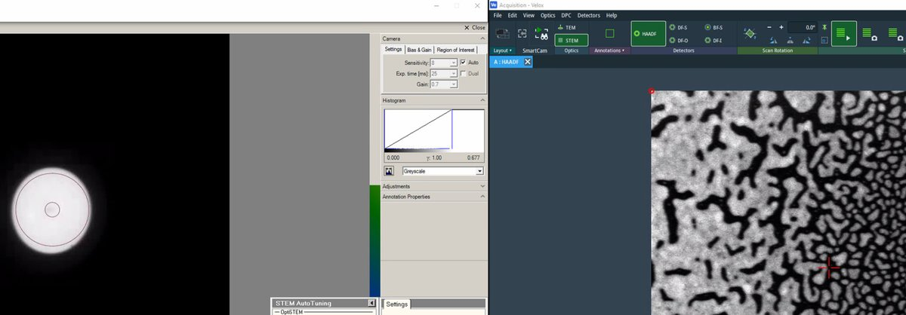

  2. Click the `Beam Blank` button to unblank the beam. Stopping the scan automatically blanks the beam. The Probe Corrector software requires an unblanked beam to read the ronchigram:

     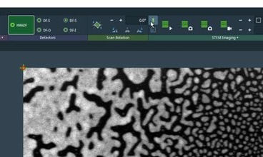

- [ ] **Run C1A1**

  1. Go to the `C1A1` tab in the `Probe Corrector` software. Before clicking Start, verify the ronchigram is visible on the left monitor:

     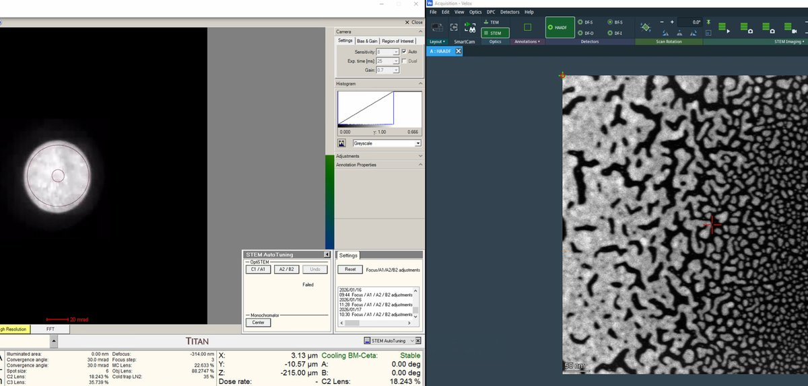

  2. Click `Start` to begin aberration measurement. The software continuously analyzes the ronchigram and displays measured aberration values (C1, A1, A2, B2, WD) in the table. For the first iteration, set Auto correct to 100%. Click `0th-2nd` to apply corrections for all first and second order aberrations:

     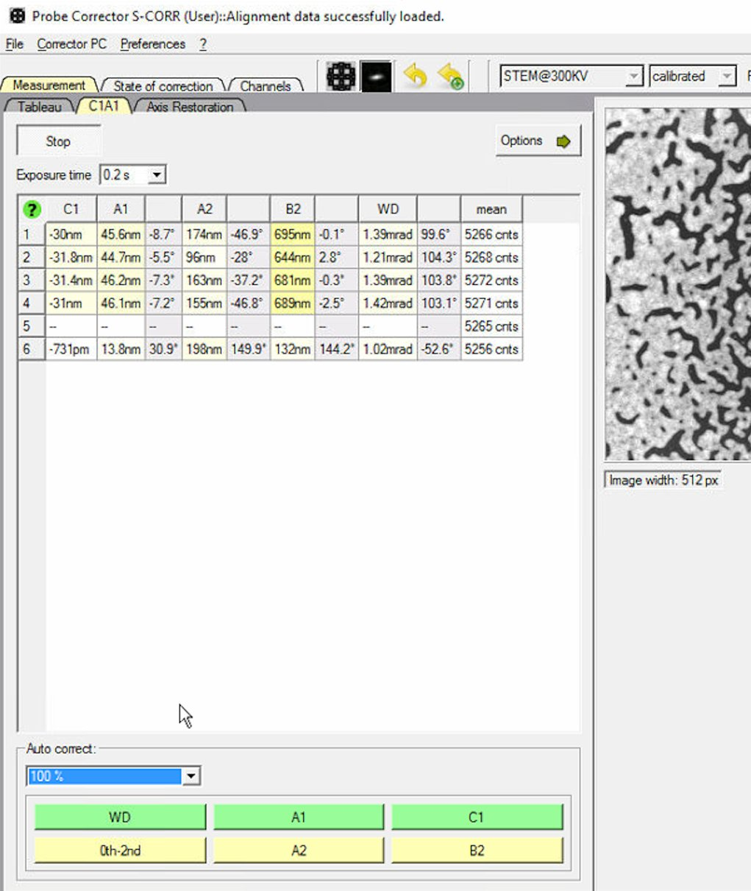

- [ ] **Iterate C1A1**

  1. Click `0th-2nd` repeatedly to apply corrections. The measurement runs continuously, with each row representing one measurement cycle. Watch the aberration values decrease with each iteration:

     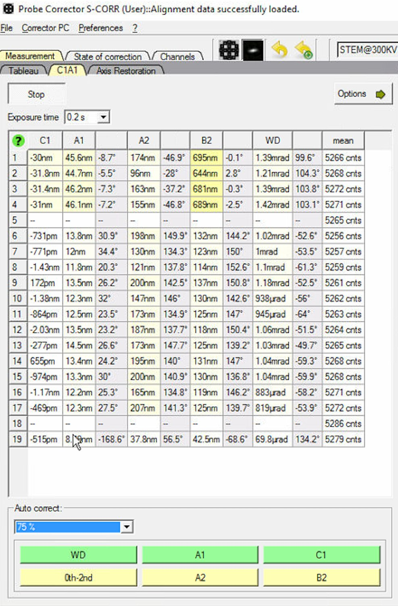

  2. Reduce the Auto correct percentage to 75% after several iterations (typically 3 to 5) to prevent overcorrection. If A1 is still high but other values are good, click `A1` specifically to correct only astigmatism:

     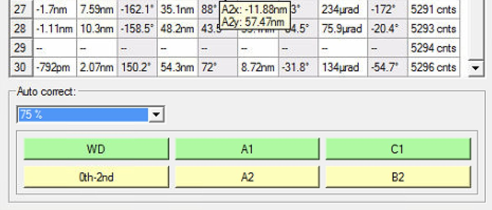

  3. **When to stop:** C1A1 values are stable when they no longer decrease significantly between iterations. Target: C1 (defocus) < 1 nm and A1 (astigmatism) < 3 nm. Click `Stop` when values are stable.

### 2.2 Tableau measurement

Tableau measures higher-order aberrations (A2, B2, C3, S3, A3) by acquiring ronchigram patterns at multiple beam tilt angles. The software analyzes how the ronchigram changes with tilt to extract the full aberration function. Tableau is more comprehensive than C1A1 and necessary for highest resolution.

- [ ] **Open Tableau tab**

  1. Switch to the `Tableau` tab in the `Probe Corrector` software for full aberration measurement and correction.
  2. Select `Standard` for Tableau type. This acquires a sufficient number of tilt positions for accurate measurement without taking excessive time.
  3. Set the Outer tableau tilt to 40 mrad. Larger tilts probe higher-order aberrations but require more time.
  4. Verify the Probe semi aperture is set to 30 mrad to match the beam settings.

     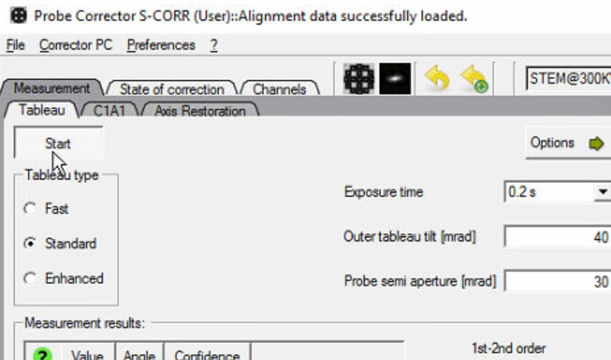

- [ ] **Run Tableau measurement**

  1. Click `Start` to begin the Tableau measurement. The software automatically tilts the beam to multiple angles and acquires ronchigram images at each position.
  2. Wait for measurement completion. The ronchigram shifts across the screen as the software captures patterns at different tilts and focus levels (under-focus and over-focus at each tilt). This movement is expected.
  3. Do not touch the stage or optical table during measurement. If the beam is unstable, stop and ask staff.

     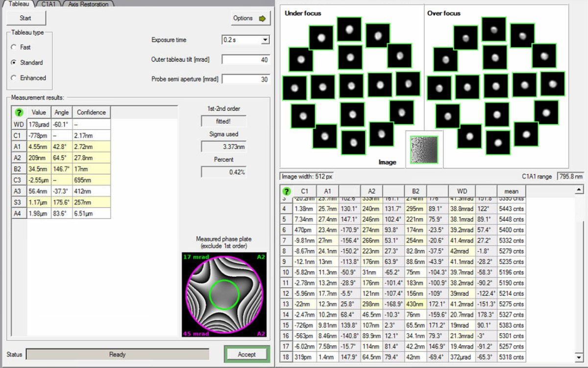

- [ ] **Accept measurement**

  1. Click `Accept` after measurement completes. This validates the data for corrections.

- [ ] **Review measurement results**

  1. Click the `State of correction` tab. This shows all measured aberration coefficients in three columns:
     - **Estimation**: Just measured values
     - **Latest accepted measurements**: Previously applied corrections (yellow = outside limits)
     - **Estimation in image coordinate system**: Values transformed to image coordinates

     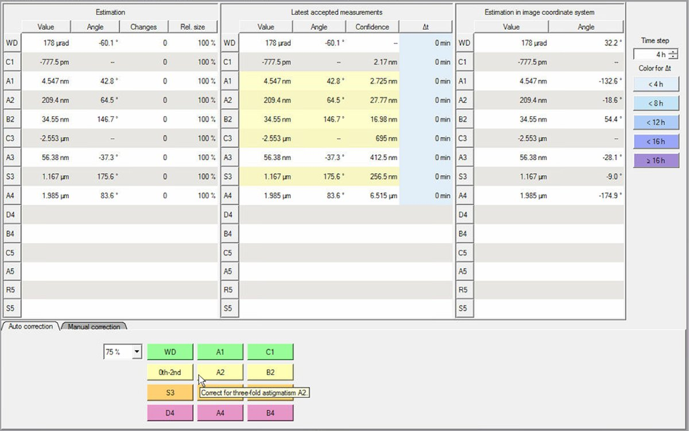

  2. Check the phase plate visualization on the right. A well corrected probe has a flat, symmetric phase plate. Strong asymmetric patterns indicate uncorrected aberrations:

     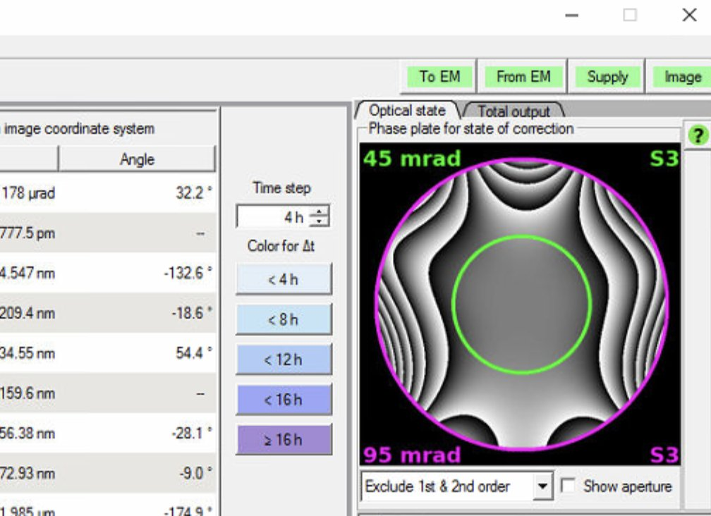

- [ ] **Apply corrections**

  1. Set Auto correct to 75% to prevent overcorrection. Yellow highlighted values in the "Latest accepted measurements" column indicate aberrations outside acceptable limits. Correct these first. In this example, S3 (1.167 μm) and C3 (-2.553 μm) are highlighted yellow:

     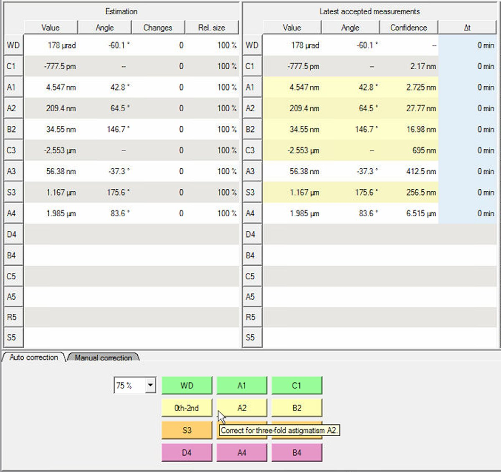

  2. Click the aberration buttons at the bottom to apply corrections. The phase plate visualization shows the **limiting aberration**. Correct this one first. Click the button repeatedly until the value improves sufficiently, then move to the next limiting aberration.
  3. The "Changes" column tracks how many corrections have been applied. After correcting S3 and C3, the values improve significantly:
     - S3: 1.167 μm → 72.93 nm
     - C3: -2.553 μm → -159.6 nm

     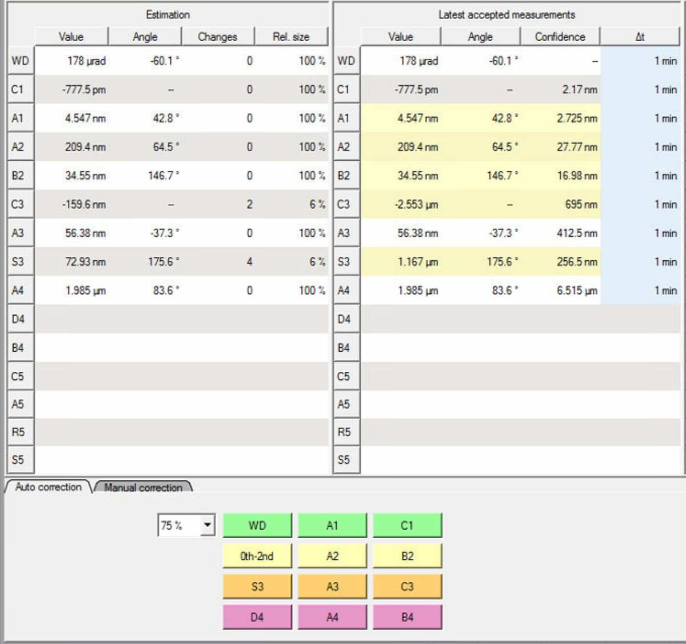

- [ ] **Run full measurement**

  1. After applying corrections, run another complete Tableau measurement to verify the improvements.
  2. Check the aberration surface and phase plate displays. A well-corrected probe shows:
     - Flat aberration surface with green in the center (minimal phase variation across the aperture)
     - Symmetric phase plates without strong directional features

     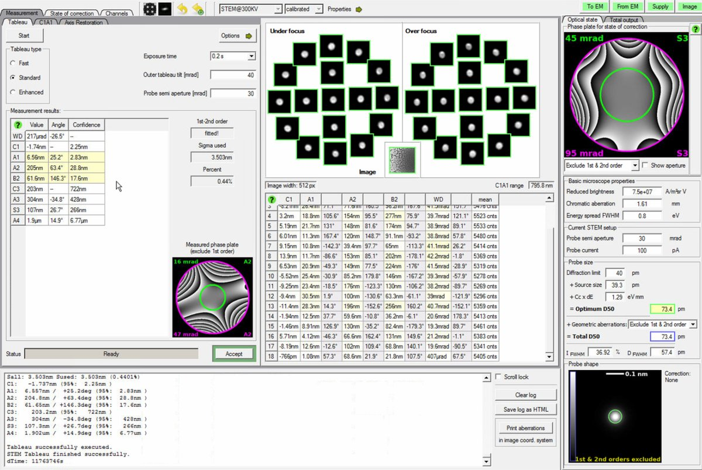

  **Target values (30 mrad semi-aperture):**

  | Parameter | Target |
  | --------- | ------ |
  | C1 | < 1 nm |
  | A1 | < 3 nm |
  | A2 | < 40 nm |
  | B2 | < 25 nm |
  | C3 | < 1.5 μm |
  | A3 | < 1 μm |
  | S3 | < 500 nm |

- [ ] **Verify with C1A1**

  1. Tableau correction can sometimes introduce small first-order errors. After completing Tableau corrections, return to the `C1A1` tab in the Probe Corrector software.
  2. Click `Start` to begin C1A1 measurement again. Click `A1` to correct any residual astigmatism introduced by Tableau. Click `0th-2nd` if defocus also needs adjustment. Iterate between Tableau and C1A1 if necessary until all values are within specification.

- [ ] **Check resolution**

  1. The `State of correction` panel displays resolution estimates on the right side: **Total D50** and **Optimum D50**. D50 represents the probe diameter containing 50% of the beam intensity (smaller = better resolution).

     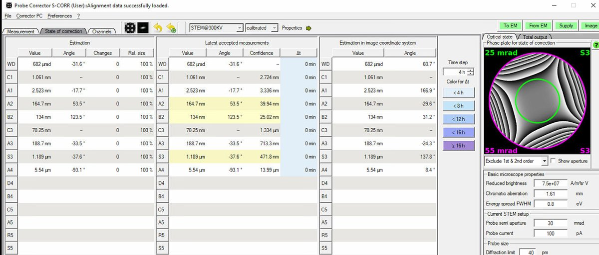

  2. Target: Total D50 of 70-75 pm for high-resolution STEM imaging. The Optimum D50 shows the theoretical best achievable with current aberrations. If these values match closely, corrections are complete.

     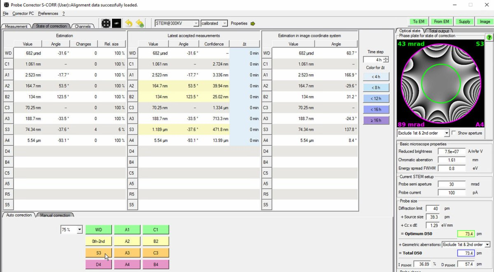

  3. If D50 values are significantly higher than target, continue iterating: run another Tableau measurement, apply corrections, then verify with C1A1. The image below shows C1A1 iterations after Tableau corrections:

     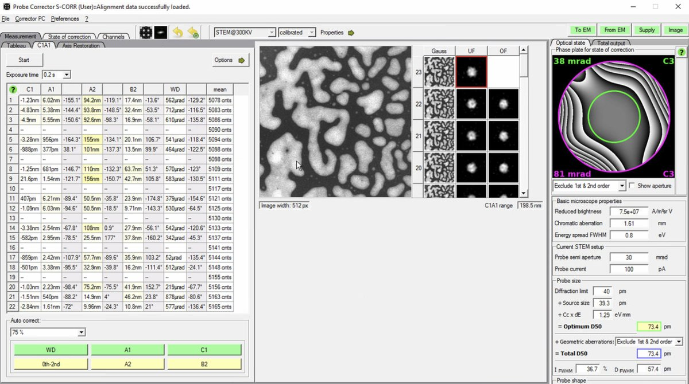

- [ ] **Return to probe image mode**

  1. Once correction is complete, press the `Diffraction` button on the hand panel to switch back to probe image mode (STEM scanning).
  2. The system is now ready for high-resolution image acquisition.

## Part 3: Imaging

### 3.1 Acquire images

With aberration correction complete, the system is ready for high-resolution STEM image acquisition. The probe is optimized for atomic-resolution imaging.

- [ ] **Acquire HAADF image**

  1. In `Velox`, click `STEM` to enter STEM mode, then click `HAADF` to select the HAADF detector.
  2. Click the play button to start live scanning. Image quality is noticeably improved compared to before correction. A well-corrected probe produces sharper, more detailed images.
  3. For initial survey imaging, set resolution to 1024×1024 and dwell time to 500 ns. Fast scanning enables navigation while maintaining image quality.

     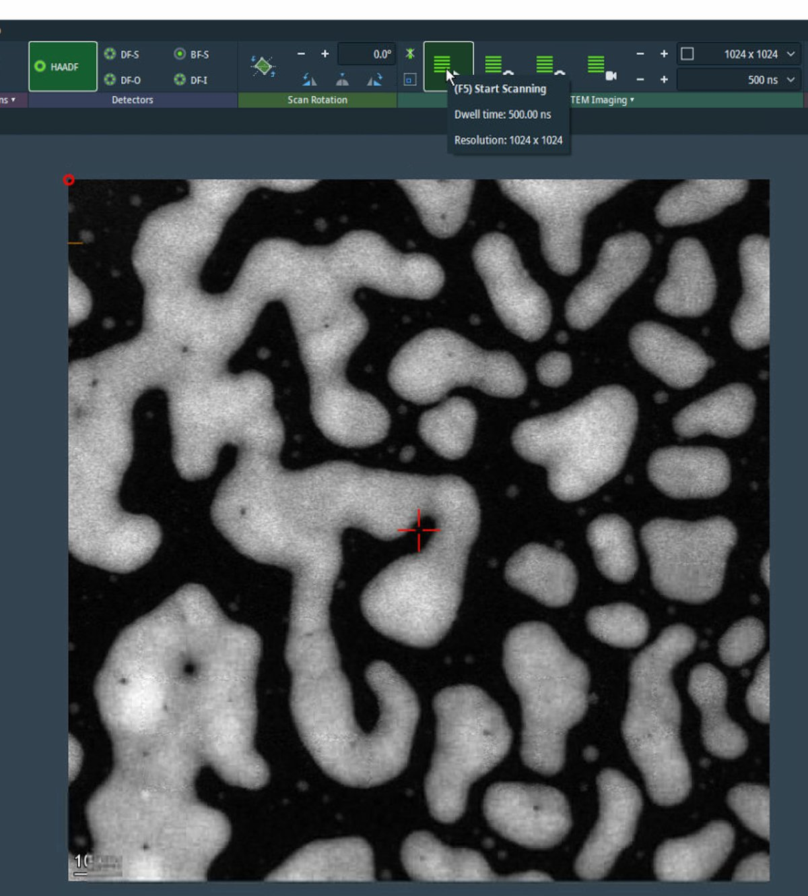

- [ ] **Navigate to area of interest**

  1. Use the live scan to find the region of interest. Use the joystick or click on the image to move to different regions. With a well-corrected probe, atomic lattice fringes are visible in crystalline materials.

     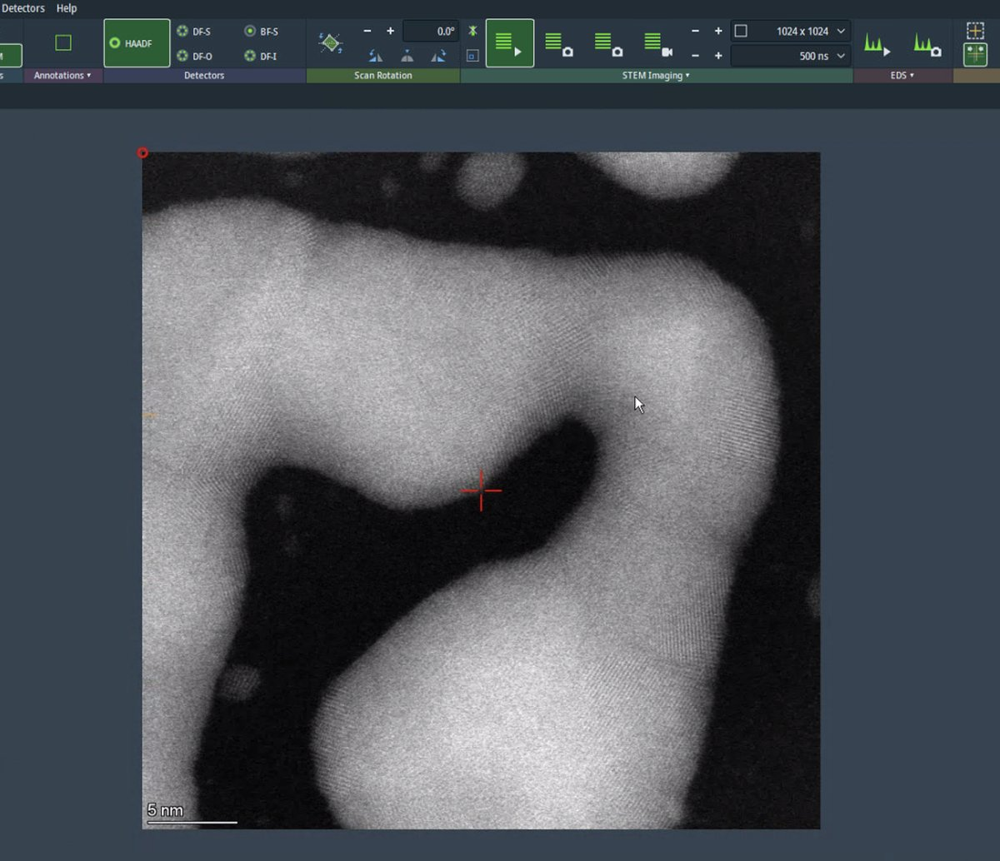

  2. Adjust focus using the z-height controls if needed. Small focus changes can significantly affect atomic-resolution contrast.

     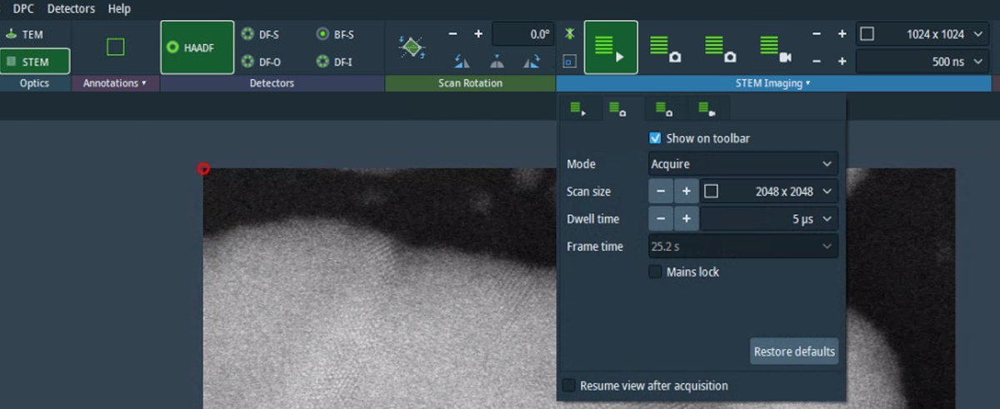

- [ ] **Capture high-resolution scan**

  1. Increase the resolution to 2048×2048 or higher. Check the Velox toolbar to verify resolution and dwell time settings before starting the acquisition.

     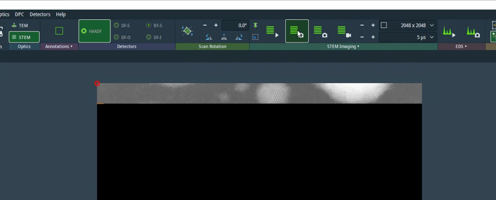

  2. Increase the dwell time to 5 µs for better signal-to-noise ratio. Longer dwell times collect more electrons per pixel, reducing noise but increasing total scan time and potential for drift artifacts. After acquisition completes, the beam is blanked automatically to prevent sample damage.

     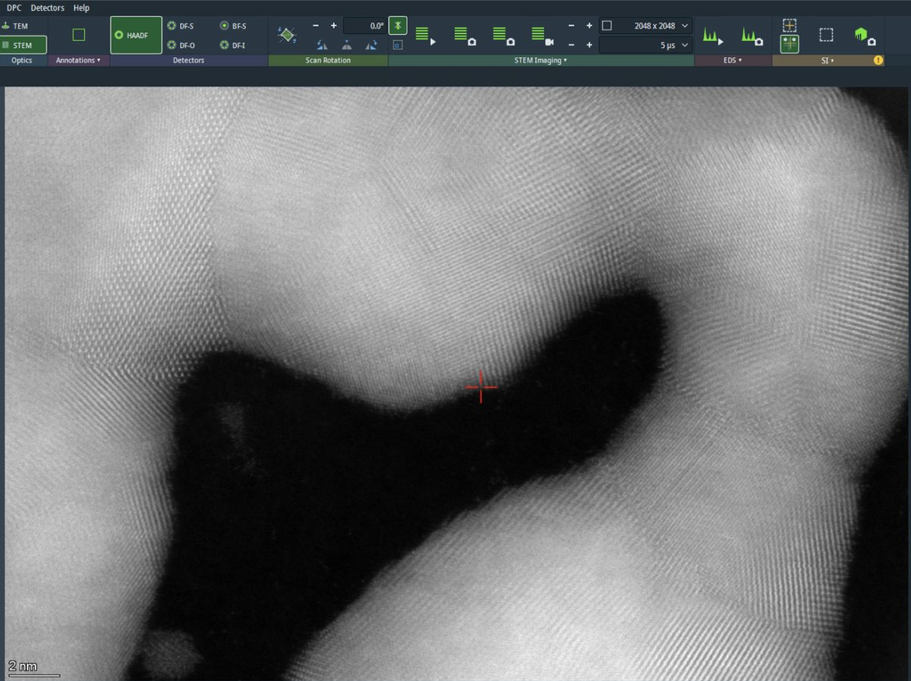

### 3.2 Fine-tuning with Sherpa

Sherpa provides rapid aberration correction that is faster than full Tableau measurement. Use Sherpa for quick refinements after the main alignment, or when aberrations drift during extended imaging sessions.

- [ ] **Prepare for Sherpa**

  1. Before running Sherpa, verify the ronchigram is centered. Press the `Diffraction` button on the hand panel to switch to diffraction mode (view the ronchigram).
  2. In `TEMUI`, go to `Direct Alignments` and select `Diffraction Shift and Focus alignment`:

     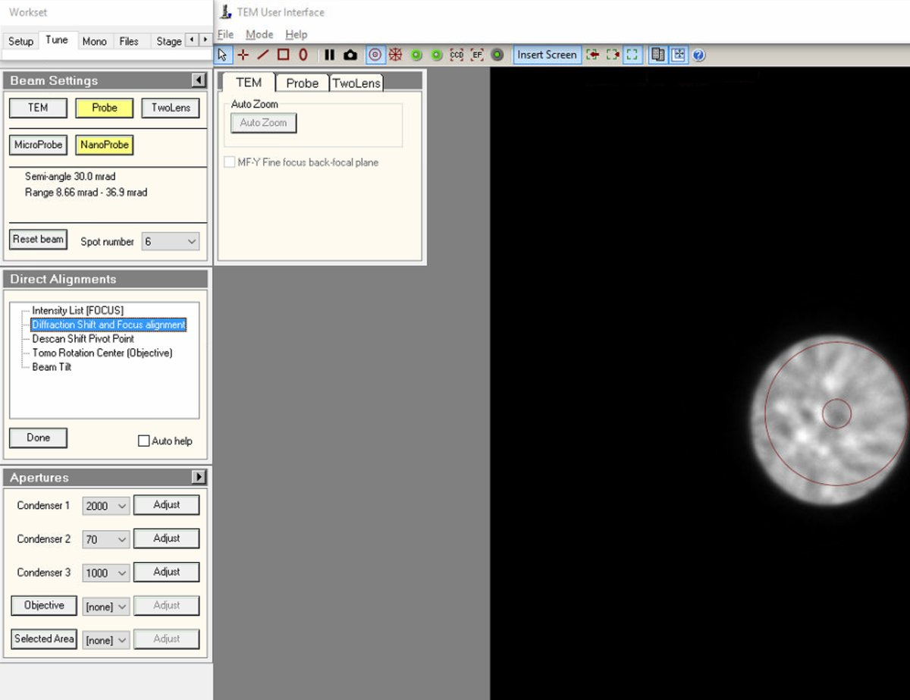

  3. Use the `mulXY` knobs to center the ronchigram on the display. A centered ronchigram ensures Sherpa measurements are accurate.

     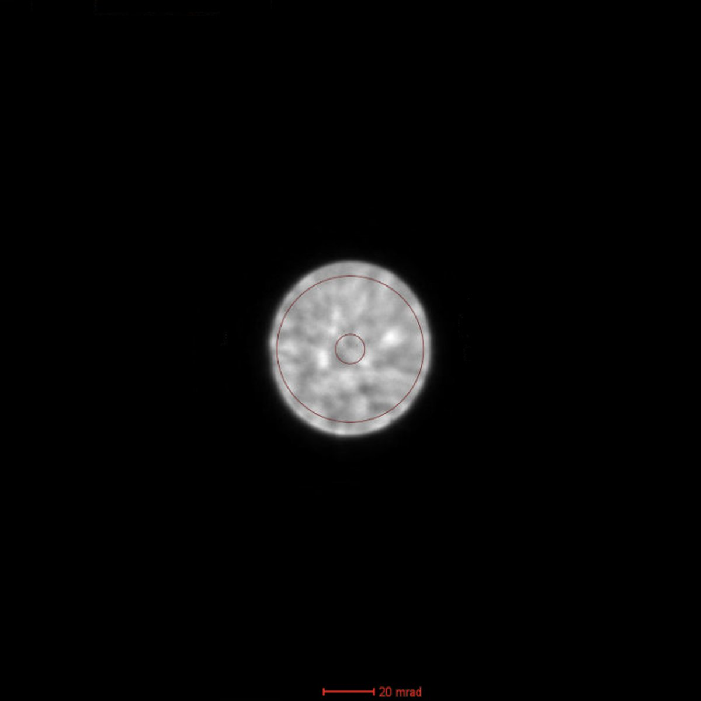

- [ ] **Adjust C2 aperture (optional)**

  1. To change C2 aperture size (for example, switching to 50 µm for different probe conditions), locate the `Apertures` panel and change Condenser 2 from 70 to 50 (or the desired size).

     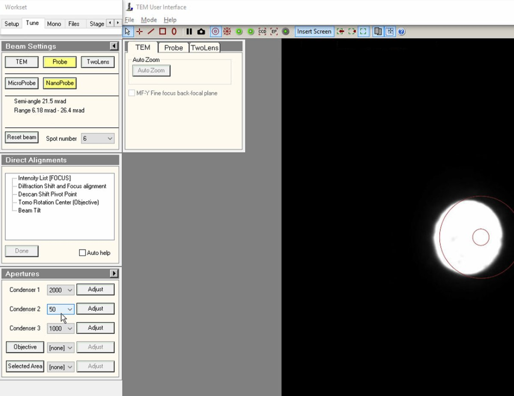

  2. Click `Adjust` to center the new aperture. The beam remains centered when changing aperture sizes. If not centered, use the adjustment controls to re-center.

     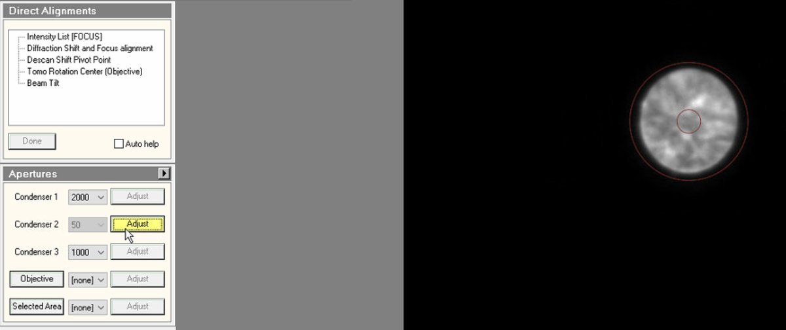

- [ ] **Open Sherpa**

  1. Open the `Sherpa` software. Sherpa displays the HAADF image with a crosshair marker indicating the measurement region.

     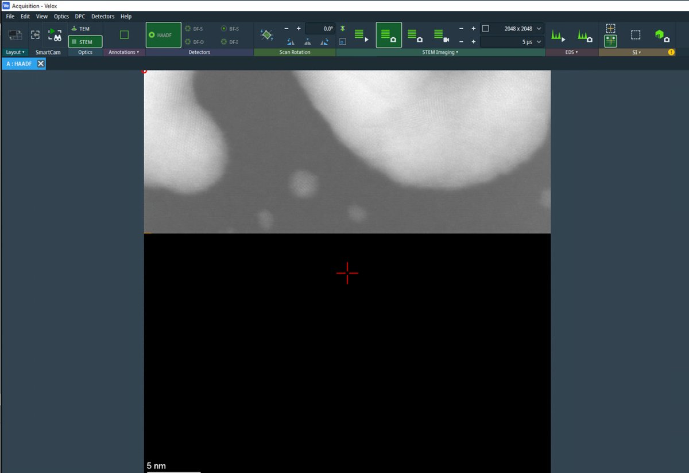

  2. Click `C1/A1` to run first-order correction (defocus and 2-fold astigmatism).

     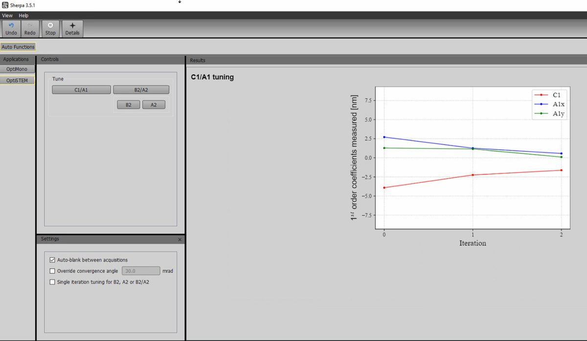

- [ ] **Run B2/A2 tuning**

  1. After C1/A1 completes, click the `B2/A2` button to correct second-order aberrations (axial coma B2 and 3-fold astigmatism A2).

  2. Wait for the tuning to complete. Sherpa acquires images and determines optimal corrections.

  3. Run multiple iterations if the first pass does not achieve optimal results.

     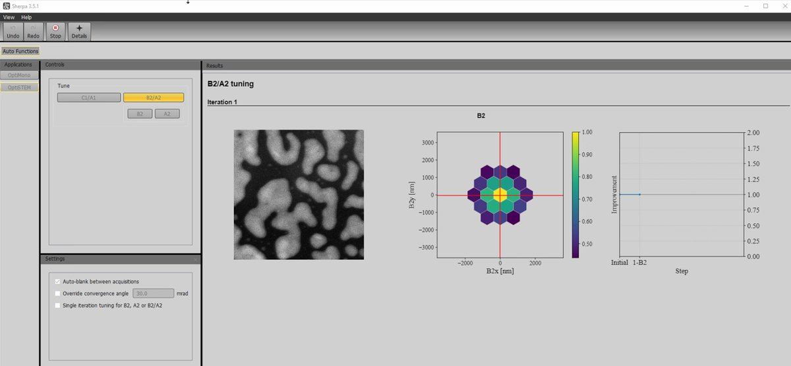

- [ ] **Review results**

  1. Sherpa displays the initial image alongside the optimized image for comparison. The corrected image shows improved sharpness and resolution.

     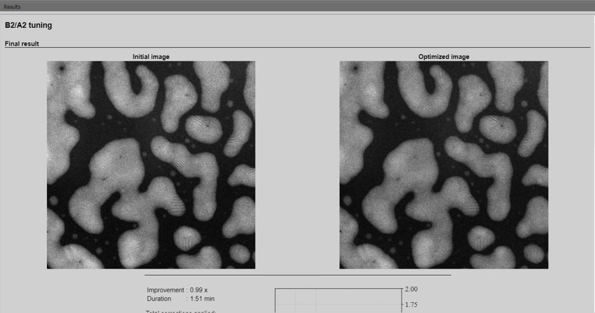

### 3.3 End session

Follow the steps in [End session](../sample-loading/index.md#end-session).

## Troubleshooting

Common problems encountered during STEM sessions.

| Problem | Cause | Solution |
| ------- | ----- | -------- |
| Image drifts when tilting | Eucentric height not set | Re-do eucentric height after loading a new sample |
| C1A1 measurements unstable or fail | Velox is still scanning | Stop live scanning in Velox before running C1A1, then verify the beam is unblanked |
| Aberration values oscillate instead of converging | Overcorrection percentage too high | Start with 100% Auto correct, reduce to 75% as values approach target |
| C1A1 or Tableau shows no signal | Beam is blanked | Click `Beam Blank` button to unblank before running aberration measurements |
| Good Tableau values but poor image resolution | Missing C1A1 verification step | After Tableau, always run C1A1 again to fine-tune defocus and astigmatism |
| Beam disappears from view | Random adjustments displaced the beam | Go to lower magnification until beam is visible, use joystick to move sample to center, then go to `Diffraction Shift` and use `mulXY` to center the beam |

## FAQ

**Beam blanking**

When the beam is blanked, the electron beam is deflected away from the sample so no electrons hit it. This prevents unnecessary radiation damage to the sample when not actively imaging. The beam is automatically blanked when scanning stops or after taking a picture. Manual blank/unblank is available via the `Beam Blank` button on the hand panel or in the software.

**Monochromator focus adjustment**

The monochromator filters the energy spread of the electron beam by passing it through a narrow slit. Setting Focus = 0 places the beam crossover exactly at the monochromator slit plane. This position maximizes electron throughput while maintaining energy filtering. If the focus is offset from zero, the beam crossover occurs before or after the slit, reducing beam current and degrading energy resolution.

## Appendix

### Aberration notation

Different notations exist for aberrations in the literature. The table below shows the Krivanek notation (used in Probe Corrector software), the alternative notation (used in this guide), and descriptions.

| Krivanek | Alt | Description | Krivanek | Alt | Description |
|----------|-----|-------------|----------|-----|-------------|
| \\(C_{10}\\) | \\(C_1\\) | Defocus | \\(C_{41}\\) | \\(B_4\\) | 4th order coma |
| \\(C_{12}\\) | \\(A_1\\) | 2-fold astigmatism | \\(C_{43}\\) | \\(D_4\\) | 3-lobe aberration |
| \\(C_{21}\\) | \\(B_2\\) | Axial coma | \\(C_{45}\\) | \\(A_4\\) | 5-fold astigmatism |
| \\(C_{23}\\) | \\(A_2\\) | 3-fold astigmatism | \\(C_{50}\\) | \\(C_5\\) | 5th order spherical |
| \\(C_{30}\\) | \\(C_3\\)/\\(C_s\\) | Spherical | \\(C_{52}\\) | \\(S_5\\) | 5th order star |
| \\(C_{32}\\) | \\(S_3\\) | Star aberration | \\(C_{54}\\) | \\(R_5\\) | Rosette |
| \\(C_{34}\\) | \\(A_3\\) | 4-fold astigmatism | \\(C_{56}\\) | \\(A_5\\) | 6-fold astigmatism |

## Changelog

- Jan 31, 2026 - Initial draft by Bob Lee based on Andrew Barnum Spectra 300 hands-on training
