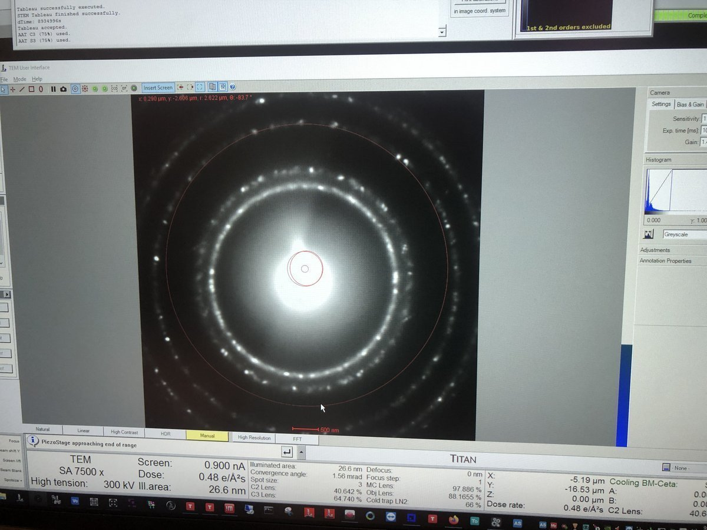
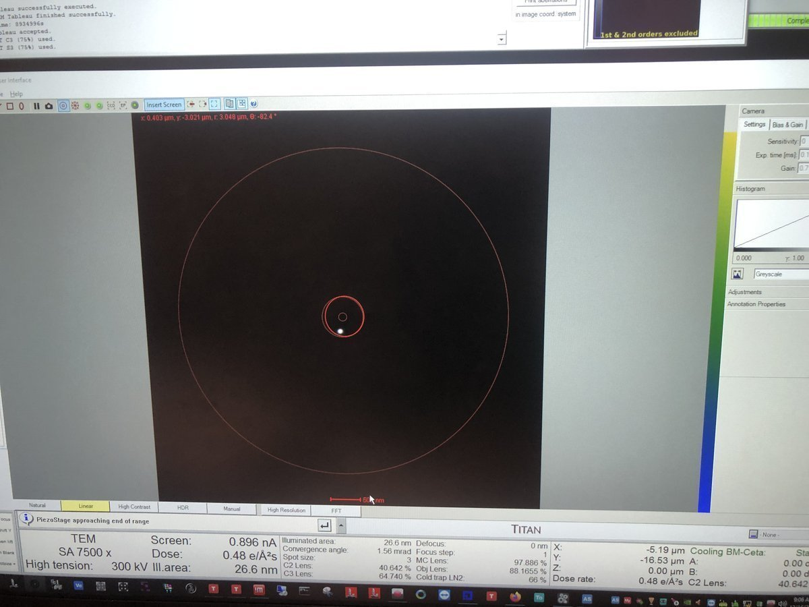
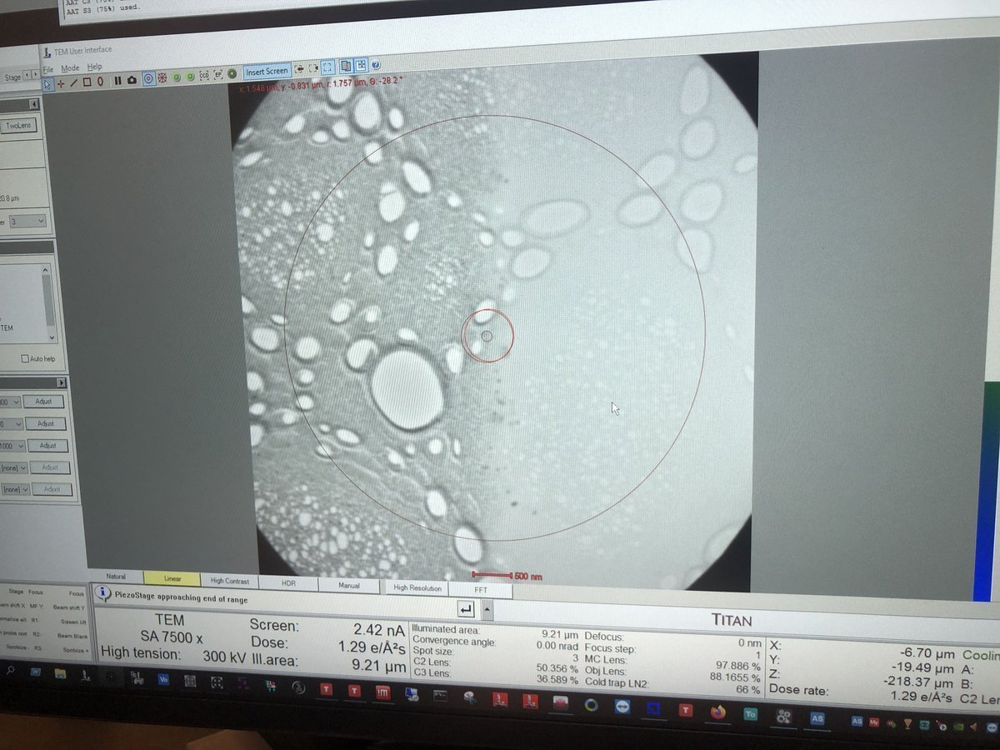

# TEM (Spectra)

This guide covers TEM alignment on the Spectra 300: column setup, eucentric height, aperture alignment, and image correction. Use TEM mode to align the column and find your sample before switching to STEM.

**Prerequisite:** Follow the [Start session](sample-loading.md#start-session) procedure.

- [ ] Sample is loaded using the holder of choice (single-tilt, double-tilt, or tomography)
- [ ] Holder is inserted into Spectra 300 instrument

**Acronyms:**

- `mulXY` - Multifunction X/Y knobs on hand panel
- `TEMUI` - TEM User Interface (software)

## Part 0: Check

> [!CAUTION]
> Ensure Standard Sample is loaded

## Part 1: Column alignment in TEM

1. **Open column valves**
   - In `TEMUI`, click `Col Valves Open`
   - This is what you see when the turbo pump is off, and the column value is open:

     

   - Verify vacuum pressure values (log scale, lower = better vacuum):

     | Gauge | Log Value | Why Important |
     |-------|-----------|---------------|
     | Gun | 1 | Highest vacuum needed for stable electron emission |
     | Liner | <10 | Prevents electron scattering along beam path |
     | Octagon | 1 | Protects sample from contamination and oxidation |
     | Projection | <30 | Maintains image quality in projection system |
     | Buffer tank | <50 | Ensures stable pumping performance |
     | Backing line | <80 | Turbo pump pushes the compressed gas into the backing line |

   - Set 2000, 70, 1000 for Condenser 1, 2, 3: Under `Tune` tab → `Apertures`

     

   - Set ~500x magnification by adjusting magnification knob
   - Locate the gold (dark) and amorphous carbon boundary by driving joystick on hand panel

     

2. **Adjust eucentric height**
   - Set ~7,500x mag by adjusting magnification knob

     

   - Press `Eucentric Focus` on hand panel

   - Notice diffraction pattern. Roll mouse scroller to see greater contrast.

     

   - Converge the beam to a tiny dot with intensity knob. Press `Z-axis` up or down until no diffraction pattern is visible.

     

   - Turn intensity knob. Notice image shows approximately minimal contrast between gold and amorphous carbon region.

     

   - Press `z-axis` up or down on hand panel to reduce contrast even further

     

3. **Align monochromator**
   - Jagged area visible like above image? Skip this section. Otherwise, continue.
   - `Mono` tab → `Monochromator Tune (Expert)`, click `Shift`

     

   - Adjust `mulXY` knobs until the jagged area disappears.

4. **Align C2 aperture**
   - Enter `TwoLens` mode. `Tune` tab → `Beam Settings`, click `Twolens`

     

   - Notice beam shifted away from center.
   - Converge beam by varying intensity knob
   - Center beam by rolling hand panel ball
   - Vary beam size by turning intensity knob counterclockwise and clockwise. Notice beam size is not concentric.
   - Make concentric beam: `Apertures` → click `Adjust` next to `Condenser 2`, adjust `mulXY` knob

     

   - Go back to three-lens mode: `Beam Settings` tab → click `TEM`  

     

   - Ensure beam is centered and concentric. Example:

     

5. **Fix condenser lens stigmatism**
   - Set ~200kx magnification by adjusting magnification knob
   - Beam shifted from center? `Tune` tab → `Direct Alignment`, click `Beam Shift`, adjust `mulXY` knobs
   - Enlarge the beam by adjusting intensity knob

     

   - Still not concentric? `Stigmator` → `Condenser`, adjust `mulXY` knobs

6. **Fix beam tilt**
   - Under `Direct Alignment`, click `Beam tilt pp X`, adjust `mulXY` knob to minimize jiggle
   - Repeat for `Beam tilt pp Y`
   - Beam center shifted again? Click `Beam Shift`, adjust `mulXY` knobs

7. **Fix rotation center**
   - Under `Direct Alignment`, click `Rotation Center`
   - Notice the image is pulsing in and out of the screen.
   - Adjust `mulXY` knobs to minimize lateral movement, parallel to the screen

8. **Capture image**
   - Find a flat area with a distribution of particle sizes and no holes
   - Press `R1` to lift fluorescent screen. This enables the beam to be detected by the detector.
   - Open `Velox` software on the right monitor
   - Click the "play" button to start seeing the image
     

   - Notice gold nanoparticles shown

     

   - (Optional) Press `z-axis` buttons to see how focus can change image:

     Under focus:

     

     On focus:

     

     Over focus:

     

9. **Run image corrector**

   Here we correct aberrations in the image-forming lenses.

   - Press `Z-axis` down until you see 4-5 rings in FFT (slight underfocus)

     

   - Stop recording by clicking the "play" button in `Velox`
   - Reset `Objective` and `Image A1` in `TEMUI` → `Stigmator` quick tab. Right-click each button to reset.

     

   - Open `ImageCorrector` software
   - Click `C1A1` tab → `Start`. The microscope physically wobbles the focus up and down (changing objective lens current). The FFT is captured and its ring symmetry, angular distribution, and ring spacing are analyzed.
   - During the iteration, set intensity to 800–900 counts by adjusting the Intensity knob.

     
     
   - Under `Auto correct`, set to `75%`, then press `Focus` and `A1` during the iteration to apply corrections.
   - Aim for `A1` < 5 nm. If `C1` shows orange, manually adjust Z-axis during the iteration.
   - `C1` should be close to the suggested number. In the image above, software suggests `C1` of −599.3 nm.

   - Now fix higher-order aberrations.
   - Go to `Tableau` tab → select `Standard` next to `Tableau type` → click `Start`

     

   - After the iteration completes, verify values match the targets below, then click `Accept`:

      | Parameter | Resolution < 0.10 nm (20 mrad) | Resolution < 0.08 nm (24 mrad) |
      |-----------|-------------------------------|--------------------------------|
      | A1        | < 5 nm                        | < 5 nm                         |
      | A2        | < 100 nm                      | < 50 nm                        |
      | B2        | < 100 nm                      | < 50 nm                        |
      | C3        | ~ −8 μm                       | ~ −8 μm                        |
      | A3        | < 5 μm                        | < 1.5 μm                       |
      | S3        | < 5 μm                        | < 1 μm                         |

   - In `Velox`, click the `camera` button to capture an image. Notice an improved image (if you can).

10. **Save optics settings**
   - `TEMUI` → `Files` → `SBL FEG Registers`
   - Add name `300KV-TEM-<NAME>` and click `Add`

     

   - Done! You are now ready for STEM probe alignment next.

11. **Verify aberration corrected image**
   - In `Velox`, click the `Play` button
   - Done! You are now ready to image your sample

## Part 3: End session

Follow the steps in [End session](sample-loading.md#end-session).

## Appendix

### Save file to USB

Plug your USB into the following computer:

<strong>Reference images (click to expand)</strong>

**Gray colors during C1A1 probe correction:**

Seeing gray colors like below?

`Velox`, click `Auto-tune`. Increase the signal until it touches the red and blue dotted lines:

**Hand panel R1, R2, R3 values:**

**Stage position and coordinates:**

**Dose rate and TEM mode display:**

**HAADF detector on TEMUI:**

**Samples with holes:**

**Wobbler to check eucentric height:**

At eucentric height, tilting of the holder should induce minimal shift.

**Smart tilt:**

**Beam setting in Quick tab:**

**Stage piezo in Quick tab:**

**Stage tab:**

## FAQs

### Software

- **Convergence angle:** `Beam Setting` → `Probe`, use `mulXY` to adjust.

- **Tableau and C1A1:** Tableau shows aberrations visually. C1A1 corrects first-order aberrations (astigmatism and coma).

- **Underfocus direction:** Counterclockwise on hand panel, Z-axis down.

- **Eucentric height:** The z-position where tilting doesn't shift the sample. Defocus = 0. Probe size smallest relative to the sample.

- **Beam Shift vs hand panel ball:** Beam Shift stores the center position internally, so the beam stays centered when changing magnification.

- **Underfocus vs overfocus:** Underfocus: edges become white/bright Fresnel fringes. Overfocus: contrast inverts.

- **Monochromator:** Filters the electron beam to select a narrow energy range, improving energy resolution for EELS.

- **Scan often:** Tilt causes FOV to change, so rescan frequently.

- **Wobble at high mag:** Ensures no sample-induced aberration.

- **Verify zone axis:** Use CrystalMaker simulated diffraction and Kikuchi lines crossing in the center.

- **Major zone axis:** Thick bends tend to form.

- **Nanoparticle area for correction:** Focus on "size gradient" region between dark film and bulk. Better for aberration algorithms.

### Lens system

- **Objective lens (TEM vs STEM):** In STEM, it sits above the sample and focuses the probe to ~1 Å. In TEM, it sits below and forms the first magnified image.

- **Back focal plane:** The objective lens focuses electrons scattered at the same angle to the same point here (forming the diffraction pattern).

- **Spherical aberration (Cs):** Electrons through outer lens focus at different points than center electrons. Blurs image, limits resolution. Cs correctors fix this.

- **Chromatic aberration (Cc):** Electrons with different energies focus at different points. Monochromator reduces this.

- **Cs corrector:** Uses multipole lenses to cancel spherical aberration, enabling sub-angstrom resolution.

- **Three condenser lenses (C1, C2, C3):** C1 controls brightness, C2 controls beam size/convergence, C3 provides additional probe formation flexibility.

- **Intensity knob:** Adjusts C2 lens to move crossover point. Clockwise = more focused, brighter. Counterclockwise = spread out, dimmer.

- **C2 aperture:** Limits beam angle and blocks stray electrons. Must be centered on optical axis.

- **Crossover symmetry:** If elliptical instead of round, there's condenser astigmatism degrading probe shape.

- **Two-lens vs three-lens mode:** Two-lens (C1+C2) for parallel illumination. Three-lens (C1+C2+C3) for STEM probe control. Align C2 in two-lens mode because it's simpler.

- **Objective aperture:** Sits at back focal plane, selects which diffracted beams contribute to image. Smaller = more contrast, less resolution.

- **Projector lenses:** Magnify and project image plane (imaging) or back focal plane (diffraction) onto screen/camera.

- **Focus changes with magnification:** Different mag uses different lens settings, slightly shifting focal plane.

- **Astigmatism correction:** Use stigmator coils (X and Y) to make elliptical beam circular.

- **Convergence angle and resolution:** Larger angle = higher resolution but more aberrations. There's an optimal angle.

### STEM detectors

- **HAADF:** High-Angle Annular Dark Field. Collects high-angle scattered electrons, gives Z-contrast.

- **ABF:** Annular Bright Field. Collects low-angle, good for light elements.

- **BF:** Bright Field. Collects direct beam.

- **Z-contrast:** Scattering scales with Z² (atomic number squared). Heavier atoms appear brighter.

- **Ronchigram:** Shadow image of probe on detector when focused on amorphous area. Flat, featureless = good alignment.

### Beam sensitive samples

- **Beam sensitive region:** Still scan, but on a small window only to avoid damaging other areas.

- **Beam intensity for sensitive materials:** ~50 pA can cause beam damage.

- **Alternative approach:** Use lower keV, but requires hours for beam to stabilize.

## References

- [Thermo Fisher Spectra 300 TEM](https://www.thermofisher.com/us/en/home/electron-microscopy/products/transmission-electron-microscopes/spectra-300-tem.html)

## Changelog

- Dec 15, 2025 - Add pre-probe corrector with STEM Direct Alignment steps by @bobleesj
- Dec 12, 2025 - Add STEM training images by Guoliang Hu
- Dec 8, 2025 - First draft of Spectra training by @bobleesj

